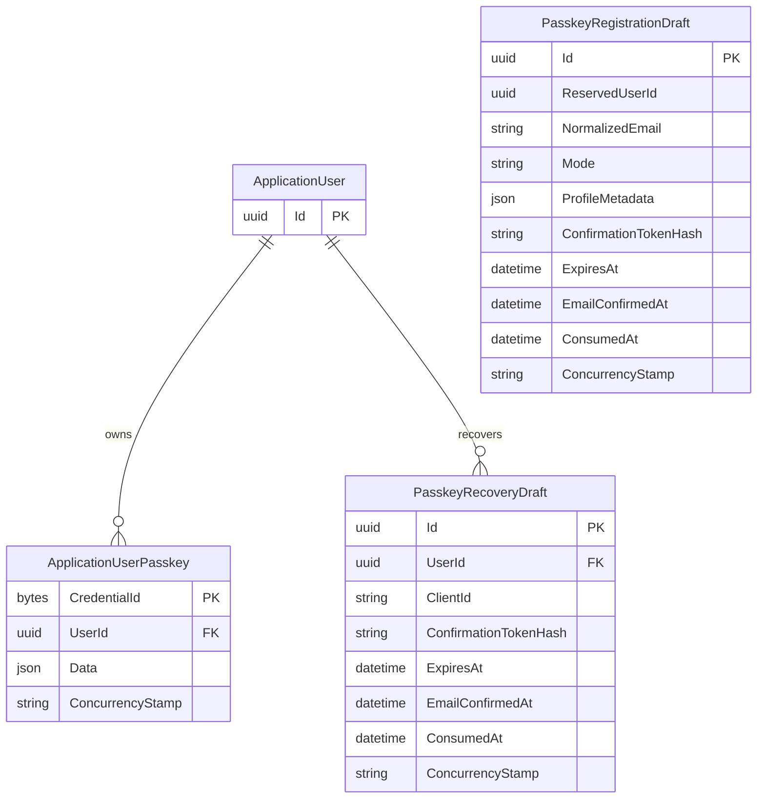
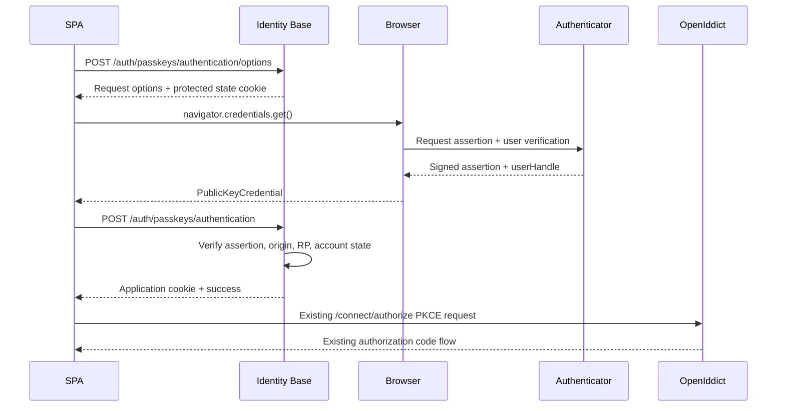
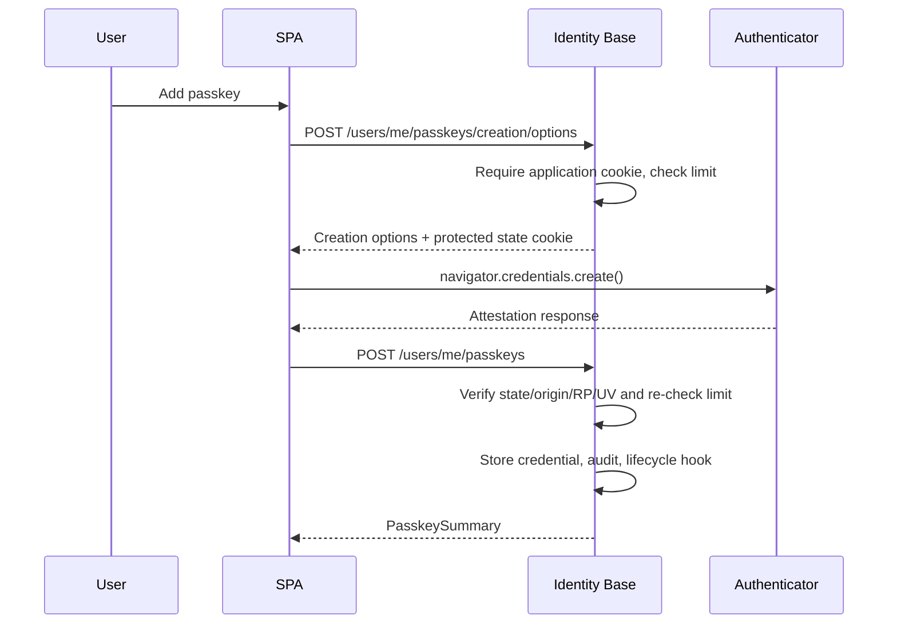
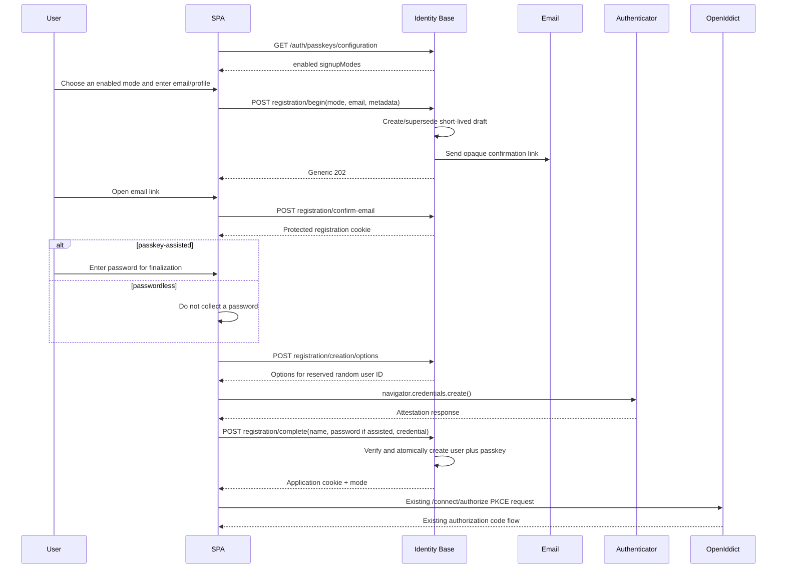

# Identity Base Passkey Support Specification

**Status:** Implemented; real-browser certification remains a release gate
**Scope:** `Identity.Base`, `Identity.Base.Admin`, browser client packages, reference host, sample client, migrations, tests, and documentation
**Implementation baseline:** .NET 10 / ASP.NET Core Identity schema version 3
**Protocol baseline:** WebAuthn Level 3, using ASP.NET Core Identity's framework implementation

## 1. Decision

Identity Base will add passkeys as a passwordless **primary authentication method** for existing user accounts and as a configurable account-creation method. A successful passkey assertion establishes the same ASP.NET Core Identity application cookie that the current password, MFA-completion, and external-login flows establish. OpenIddict remains unchanged: after interactive authentication, `/connect/authorize` consumes that cookie and completes the authorization-code + PKCE flow.

The implementation will:

- use ASP.NET Core Identity's .NET 10 passkey APIs and EF Core passkey store;
- require discoverable credentials and user verification, enabling username-less and conditional-UI sign-in;
- add self-service passkey registration, listing, rename, and removal;
- support both passkey-assisted signup (password plus passkey) and passwordless signup (passkey only);
- let each Identity Base host enable either signup mode, both modes, or neither, without changing the existing password-registration contract;
- add administrator revocation of all passkeys for an account;
- extend the framework-agnostic, React, and Angular browser clients;
- keep passwords, current MFA methods, recovery codes, and external providers working;
- ship disabled by default until a host explicitly configures its relying-party domain, origins, and host-owned migration.

The implementation will not add a third-party WebAuthn library to the current .NET 9 target. Framework-native passkeys require .NET 10, and maintaining a temporary credential model, ceremony validator, and migration path would duplicate security-sensitive behavior that ASP.NET Core Identity now provides.

References:

- [ASP.NET Core Identity passkey documentation](https://learn.microsoft.com/aspnet/core/security/authentication/passkeys/?view=aspnetcore-10.0)
- [W3C Web Authentication Level 3](https://www.w3.org/TR/webauthn-3/)
- [ASP.NET Core Identity `UserPasskeyInfo`](https://learn.microsoft.com/dotnet/api/microsoft.aspnetcore.identity.userpasskeyinfo?view=aspnetcore-10.0)

## 2. Current-State Fit

| Current contract | Repository location | Passkey design consequence |
| --- | --- | --- |
| Password login establishes `IdentityConstants.ApplicationScheme` and returns the client ID | `Identity.Base/Features/Authentication/Login/LoginEndpoint.cs` | Passkey authentication returns the same response shape and establishes the same cookie. It does not issue tokens directly. |
| TOTP, SMS, email, and recovery codes use the two-factor cookie | `Identity.Base/Features/Authentication/Mfa/MfaEndpoints.cs` | Passkeys are not added to `MfaVerifyRequest`. ASP.NET Core treats passkeys as primary authentication and explicitly bypasses the separate 2FA step after a verified assertion. |
| `/connect/authorize` consumes the application cookie | `Identity.Base/Features/Authentication/Authorize/AuthorizeEndpoint.cs` | OpenIddict handlers, scopes, claims, tokens, and PKCE behavior need no passkey-specific branch. |
| Browser mutations under `/auth` are protected by exact/same-site origin checks | `Identity.Base/Features/Security/BrowserOriginGuardEndpointFilter.cs` | Anonymous passkey ceremonies inherit this filter. The new self-service passkey write group must add it explicitly because it is mapped beneath `/users`, while WebAuthn origin validation adds a second, stricter check to creation/authentication. |
| Self-service user endpoints accept application cookie or bearer token | `Identity.Base/Features/Users/UserEndpoints.cs` | Passkey listing may accept either. Registration, rename, and removal require the application cookie because a stolen API access token must not be sufficient to add a durable login credential. |
| Core identity data lives in `AppDbContext`; hosts own migrations | `Identity.Base/Data/AppDbContext.cs` and database guidelines | Passkeys extend `AppDbContext`. Every enabling host must generate and apply its own provider-specific migration before enabling the feature. |
| Client packages are headless and already send cookies cross-origin | `packages/identity-client-core`, `packages/identity-react-client`, `packages/identity-angular-client` | WebAuthn orchestration belongs in `client-core`; React and Angular expose framework adapters without shipping opinionated UI. |
| Admin user operations are permission-gated and audited | `Identity.Base.Admin/Features/AdminUsers/AdminUserEndpoints.cs` | Passkey revocation is a separate admin permission and audit event, not part of `users.reset-mfa`. |

## 3. Goals

1. Let an existing, confirmed Identity Base user add up to a configured number of passkeys.
2. Let a host independently enable passkey-assisted signup, passwordless signup, both, or neither.
3. Let a new user complete either enabled passkey signup mode without creating a dangling `ApplicationUser` when the ceremony is abandoned.
4. Let a user sign in without entering an email or password by using a discoverable passkey.
5. Support browser conditional UI/autofill when available and a normal “Sign in with a passkey” button everywhere else.
6. Preserve the existing OIDC authorization-code + PKCE contract.
7. Keep email ownership, account lockout, soft-delete, origin, audit, recovery, and administrative controls effective for passkey accounts.
8. Provide complete headless client APIs and real sample-client journeys for both signup modes.
9. Make deployment requirements explicit: one relying-party domain, compatible browser origins, HTTPS, and host-owned migrations.

## 4. Non-Goals for the First Release

- Removing a user's password or converting an account to passkey-only.
- Disabling or changing the behavior of the existing password-only `/auth/register` endpoint. Passkey signup uses a separate resumable flow.
- Treating a passkey as another `MfaVerifyRequest` method.
- Enterprise authenticator allow/deny lists or attestation trust-chain validation.
- Cross-domain passkey sharing between unrelated registrable domains.
- Native iOS/Android associated-domain integration.
- Transaction confirmation or WebAuthn extensions beyond the framework's authentication use case.
- A hosted Identity Base login UI. The existing headless SPA/client model remains the supported UI model.
- Changes to OpenIddict token grants, claims, scopes, or downstream bearer-token validation.

## 5. Runtime and Package Baseline

### 5.1 Required upgrade

Before passkey implementation, upgrade the solution from .NET 9 to .NET 10:

- all `.csproj` target frameworks;
- ASP.NET Core and EF Core package references;
- PostgreSQL and SQL Server EF providers;
- test host packages;
- build images, CI SDK setup, Docker images, samples, and documentation.

This should be a separate, reviewable change. It must prove the existing full solution and npm packages before passkey code is introduced.

### 5.2 Why not multi-target

`Identity.Base` owns `AppDbContext`, the ASP.NET Core Identity store, endpoint wiring, and `SignInManager`. A `net9.0` build cannot expose the .NET 10 passkey store or APIs. Multi-targeting would produce materially different authentication and database models under the same package version, complicating host migrations and support. The chosen release therefore raises the minimum runtime for all .NET packages together.

### 5.3 Identity store schema

When `Passkeys:Enabled` is `true`, Identity Base configures:

```csharp
identityOptions.Stores.SchemaVersion = IdentitySchemaVersions.Version3;
```

Schema version 3 is required for ASP.NET Core Identity's passkey entity. When passkeys are disabled, Identity Base does not expose passkey endpoints and does not require the new table. The options validator must fail startup if endpoints are enabled while schema version 3 is not active.

## 6. Relying-Party and Origin Model

WebAuthn credentials are scoped to one relying-party ID (RP ID). The RP ID is a domain, not a URL.

For the common deployment:

- SPA: `https://app.example.com`
- Identity host: `https://identity.example.com`
- RP ID: `example.com`

the browser can create a passkey from `app.example.com` because the configured RP ID is a registrable suffix of that origin. Identity Base must validate the returned origin against an exact allow-list.

This topology has an important security consequence: any malicious script running on an allowed origin, and potentially untrusted content within the RP ID's subdomain scope, can undermine WebAuthn's guarantees. A host must not choose `example.com` if it serves untrusted tenant or user content on subdomains of `example.com`.

Rules:

1. `ServerDomain` is mandatory when passkeys are enabled. It is never inferred from the request `Host` header.
2. `AllowedOrigins` is mandatory and uses exact normalized origins. Wildcards are forbidden.
3. Every allowed origin's host must equal `ServerDomain` or be its subdomain.
4. Every allowed origin must also be present in `Cors:AllowedOrigins`.
5. Production origins must use HTTPS.
6. Development may use `http://localhost[:port]` with `ServerDomain: "localhost"`.
7. One Identity Base deployment supports one RP ID. Apps on unrelated registrable domains require separate Identity Base relying parties or a future related-origin/hosted-login design.

## 7. Configuration Contract

```json
{
  "Passkeys": {
    "Enabled": false,
    "ServerDomain": "example.com",
    "AllowedOrigins": [
      "https://app.example.com",
      "https://identity.example.com"
    ],
    "AuthenticatorTimeoutSeconds": 180,
    "ChallengeSize": 32,
    "UserVerification": "required",
    "ResidentKey": "required",
    "Attestation": "none",
    "MaxPasskeysPerUser": 10,
    "NameMaxLength": 100,
    "Signup": {
      "EnabledModes": [
        "passkey-assisted",
        "passwordless"
      ],
      "ConfirmationUrlTemplate": "https://app.example.com/register/passkey?draftId={draftId}&token={token}",
      "DraftLifetimeMinutes": 30
    },
    "Recovery": {
      "ConfirmationUrlTemplate": "https://app.example.com/recover/passkey?draftId={draftId}&token={token}",
      "DraftLifetimeMinutes": 30
    }
  }
}
```

`PasskeyOptions` and its nested `PasskeySignupOptions` are public configuration models bound and validated with `ValidateOnStart`, following `MfaOptions` and the other core options.

`EnabledModes` is the host-owned library policy:

| Configuration | Result |
| --- | --- |
| `[]` | Existing-user enrollment and passkey sign-in are enabled, but passkey signup is not exposed. |
| `["passkey-assisted"]` | New users may create an account with both a password and a passkey. |
| `["passwordless"]` | New users may create a passkey-only account. |
| `["passkey-assisted", "passwordless"]` | The client presents both and the end user chooses. |

The server, not the client, enforces this list. A submitted mode not present in `EnabledModes` returns `400 unsupported_registration_mode`. Duplicate values and unknown strings fail startup. The order has no security meaning and clients must not infer a preferred mode from it.

The existing `/auth/register` password-only flow remains available and unchanged. A future general registration-policy feature may allow a host to disable password-only registration; this passkey option does not silently alter an existing public endpoint.

Fixed secure defaults:

| Option | Required/default | Rule |
| --- | --- | --- |
| `Enabled` | `false` | Hosts opt in only after configuration and migration. |
| `ServerDomain` | required when enabled | Domain only; no scheme, port, path, wildcard, or public suffix. |
| `AllowedOrigins` | required when enabled | Exact absolute origins; no path, query, fragment, user info, or wildcard. |
| `AuthenticatorTimeoutSeconds` | `180` | Allowed range 60–600; must not exceed the passkey state-cookie lifetime. |
| `ChallengeSize` | `32` | Allowed range 32–64 bytes. |
| `UserVerification` | `required` | Fixed to `required` in v1. Startup fails for another value. |
| `ResidentKey` | `required` | Fixed to `required` in v1 so username-less sign-in is reliable. |
| `Attestation` | `none` | Fixed to `none` in v1. No enterprise authenticator assurance is claimed. |
| `MaxPasskeysPerUser` | `10` | Allowed range 1–20; checked before options generation and again before storage. |
| `NameMaxLength` | `100` | Allowed range 1–200. |
| `Signup:EnabledModes` | `[]` | Zero or more unique values from `passkey-assisted` and `passwordless`; must be empty when passkeys are disabled. |
| `Signup:ConfirmationUrlTemplate` | required when a signup mode is enabled | HTTPS URL in production containing exactly the required `{draftId}` and `{token}` placeholders. |
| `Signup:DraftLifetimeMinutes` | `30` | Allowed range 10–60; confirmed drafts and registration cookies cannot outlive it. |

The builder maps these values into `IdentityPasskeyOptions`, including a custom exact-origin validator. Hosts needing custom attestation in a later release can be given an explicit builder callback; v1 does not expose a configuration string that implies trust validation it does not perform.

## 8. Persistence

### 8.1 Model

ASP.NET Core Identity schema version 3 adds passkey storage. Identity Base uses a thin `ApplicationUserPasskey : IdentityUserPasskey<Guid>` extension so the mutable framework JSON record has an Identity Base concurrency stamp, then maps it through the existing table-prefix convention:

```text
Identity_UserPasskeys
```

Conceptual model:



The framework record contains:

- credential ID;
- public key;
- friendly name;
- creation timestamp;
- signature counter;
- authenticator transports;
- user-verification flag;
- backup-eligibility and backup-state flags;
- attestation object;
- collected client-data JSON.

The `CredentialId` maximum is 1024 bytes, matching the framework mapping for WebAuthn's 1023-byte maximum. `Data` remains the framework-owned JSON object. `ConcurrencyStamp` is a required, bounded string and EF concurrency token; `AppDbContext` rotates it whenever a passkey row is modified. This prevents a rename racing an assertion from silently restoring an old signature counter or backup state. The user foreign key cascades on hard delete. A soft-deleted user retains passkeys but cannot authenticate.

Add `IX_Identity_UserPasskeys_UserId` (using the configured prefix) because listing and limit enforcement query by owner. Final registration re-checks the per-user limit and inserts inside a serializable transaction; a serialization/concurrency failure is translated to `409 passkey_limit_reached` after one bounded retry. This makes the configured maximum a hard server-side limit rather than a best-effort pre-check.

`AppDbContext` moves to the full .NET 10 `IdentityDbContext<..., ApplicationUserPasskey>` generic form. `AddEntityFrameworkStores<AppDbContext>()` remains the store registration entry point, so assertion/attestation still use the framework `UserManager`/`SignInManager` APIs. An internal passkey repository supplies Identity Base-specific list, rename, limit, and transactional bulk-removal operations without exposing raw `DbContext` access from endpoints.

### 8.2 Registration drafts

Passkey signup uses a server-side `PasskeyRegistrationDraft`; it does not create an incomplete `ApplicationUser` before email ownership and WebAuthn attestation succeed. The draft stores:

- an opaque draft ID;
- a reserved random `ApplicationUser.Id` GUID used as the WebAuthn user handle;
- email and normalized email;
- validated profile metadata and display name;
- selected signup mode and OIDC client ID;
- a SHA-256 hash of a 256-bit random email-confirmation token;
- created, expiry, confirmation, and consumption timestamps;
- a concurrency stamp.

It never stores a password, password hash, passkey private material, WebAuthn response, or unprotected confirmation token. For passkey-assisted signup the password is accepted only by the finalization request and passed directly to `UserManager.CreateAsync(user, password)`.

At most one live draft exists for a normalized email. Beginning again supersedes the previous draft and invalidates its token and registration cookie. The begin endpoint returns the same `202` shape whether the email is new, already registered, blocked, or superseding an earlier draft. A background cleanup service deletes expired/consumed drafts after the configured retention window; no authentication decision depends on cleanup having run.

Finalization first consumes the one-time protected WebAuthn ceremony, verifies attestation/RP/origin/challenge/user verification, constructs the proposed unsaved user, and runs the registration lifecycle veto. It then opens a serializable transaction that:

1. locks and revalidates the confirmed, unexpired, unconsumed draft;
2. rechecks normalized-email uniqueness and the configured signup mode;
3. creates the `ApplicationUser` with a password for `passkey-assisted`, or without one for `passwordless`;
4. sets `EmailConfirmed=true` because the draft email was already proven;
5. adds the verified passkey;
6. marks the draft consumed and commits.

Committed registration/passkey lifecycle notifications and audit telemetry run only after commit. Their delivery follows the repository's existing post-commit reliability contract and cannot make a committed account appear rolled back.

Any failure rolls back both user and passkey creation. Because WebAuthn ceremony state is one-time, a retry after attestation failure or transaction rollback obtains new creation options; it may reuse the still-valid confirmed draft.

### 8.3 Recovery drafts

The built-in passwordless recovery flow uses a separate short-lived `PasskeyRecoveryDraft`. It stores an opaque ID, the account user ID, OIDC client ID, hashed random email-proof token, timestamps, and concurrency stamp. It contains no password, email copy, credential payload, or authenticated session.

Beginning recovery always returns the same response. A draft and email are created only for a confirmed, non-deleted account that currently has passkeys. Beginning again supersedes earlier recovery drafts for the user. The confirmation cookie reveals no user ID to client code and authorizes only recovery creation-options/finalization endpoints. Full recovery adds the new verified passkey before revoking every older passkey in the same serializable transaction, so a database failure cannot leave the account with zero credentials.

### 8.4 API exposure

The API never returns the public key, attestation object, client-data JSON, or signature counter. It returns:

```json
{
  "id": "<base64url credential id>",
  "name": "Work MacBook",
  "createdAt": "2026-07-29T12:00:00Z",
  "transports": ["internal", "hybrid"],
  "isBackupEligible": true,
  "isBackedUp": true,
  "concurrencyStamp": "e82ee89f4a194f77b0d72874b7a96960"
}
```

The credential ID is an opaque, base64url-encoded identifier. It is only exposed to the owner and authorized administrators. Logs must use neither the raw ID nor the public key.

### 8.5 Migrations

Identity Base still ships no migrations. Enabling hosts must:

1. upgrade to the .NET 10 package;
2. enable passkeys in the design-time host configuration;
3. generate a new `AppDbContext` migration;
4. review the prefixed passkey, registration-draft, and recovery-draft tables, credential key length, JSON mapping, indexes/primary keys, token-hash length, expiry indexes, and cascade behavior;
5. generate/update both PostgreSQL and SQL Server reference-host migrations;
6. apply the migration before deploying with `Passkeys:Enabled=true`;
7. verify startup and `/healthz`, then run a real registration and authentication smoke test.

Rollback is application-first: disable passkey endpoints and roll back the app. Do not drop the credential table during an emergency rollback; preserve registered credentials for forward recovery. A later planned migration may remove it only after an explicit retention decision.

## 9. Server Architecture

Add a feature folder:

```text
Identity.Base/Features/Authentication/Passkeys/
  PasskeyEndpoints.cs
  PasskeyAuthenticationService.cs
  PasskeyManagementService.cs
  PasskeySignupService.cs
  PasskeyRegistrationDraft.cs
  PasskeyRecoveryService.cs
  PasskeyRecoveryDraft.cs
  PasskeyDraftCleanupService.cs
  PasskeyContracts.cs
  PasskeyValidators.cs
```

Responsibilities:

- `PasskeyEndpoints` owns HTTP mapping and ProblemDetails translation.
- `PasskeyAuthenticationService` validates the interactive OIDC client, creates assertion options, verifies assertions, checks account state, persists updated credential state, and establishes the application cookie.
- `PasskeyManagementService` lists, creates, renames, and removes credentials while enforcing ownership and limits.
- `PasskeySignupService` owns draft creation, generic email-dispatch behavior, email proof, creation options, and atomic account/passkey finalization for both configured signup modes.
- `PasskeyRecoveryService` owns enumeration-resistant recovery proof and atomic replacement/revocation.
- `PasskeyDraftCleanupService` removes expired and consumed registration/recovery data in bounded batches.
- Framework `SignInManager`/`UserManager` own WebAuthn parsing, cryptographic verification, challenge validation, origin/RP checks, and EF persistence.

Map the self-service routes independently of the existing mixed-scheme `/users` group. Listing uses the current application-cookie-or-OpenIddict policy. Creation, rename, and removal use a dedicated application-cookie-only group with `BrowserOriginGuardEndpointFilter`; adding an application-scheme attribute beneath the existing mixed-scheme group would not be treated as a narrowing boundary.

Do not call `SignInManager.PasskeySignInAsync` directly from the endpoint. The endpoint needs explicit Identity Base account checks around the assertion:

1. call `PerformPasskeyAssertionAsync`;
2. reject a failed assertion with the generic authentication error;
3. run the equivalent of `CanSignInAsync`, then reject locked-out users; the confirmation and lockout checks also cover the current admin soft-delete representation (unconfirmed plus lockout through year 9999);
4. persist the returned updated passkey so signature counter and backup flags are current;
5. reset the user's failed-access count;
6. establish a non-persistent application cookie with authentication method `passkey`;
7. emit audit/telemetry.

This preserves repository account policy while still delegating WebAuthn verification to the framework.

## 10. HTTP API

All browser-facing passkey endpoints are mapped only when `Passkeys:Enabled=true`. Disabled hosts return `404`, not a partially configured capability.

### 10.1 Public authentication endpoints

| Method | Route | Auth | Purpose |
| --- | --- | --- | --- |
| `GET` | `/auth/passkeys/configuration` | anonymous | Returns enabled client-visible behavior without secrets. |
| `POST` | `/auth/passkeys/authentication/options` | anonymous | Starts a username-less assertion and writes one-time protected state. |
| `POST` | `/auth/passkeys/authentication` | anonymous | Verifies the assertion and establishes the application cookie. |

Configuration response:

```json
{
  "enabled": true,
  "usernameless": true,
  "conditionalUi": true,
  "userVerification": "required",
  "signupModes": [
    "passkey-assisted",
    "passwordless"
  ],
  "signupEmailVerificationRequired": true
}
```

Options request:

```json
{
  "clientId": "sample-spa"
}
```

The server validates that `clientId` is a configured public authorization-code client with PKCE permissions. It then calls `MakePasskeyRequestOptionsAsync(null)`. No email is accepted, no account lookup occurs, and the response cannot enumerate registered users. The response body is the framework's `PublicKeyCredentialRequestOptions` JSON with `application/json`.

Authentication request:

```json
{
  "clientId": "sample-spa",
  "credential": {
    "id": "...",
    "rawId": "...",
    "type": "public-key",
    "response": {}
  }
}
```

Success:

```json
{
  "message": "Login successful. Continue with authorization code flow.",
  "clientId": "sample-spa",
  "authenticationMethod": "passkey"
}
```

The SDK then starts the existing authorization-code + PKCE flow. No access or refresh token is returned by the passkey endpoint.

### 10.2 Signup endpoints

Signup routes are mapped only when at least one corresponding mode is configured:

| Method | Route | Auth | Purpose |
| --- | --- | --- | --- |
| `POST` | `/auth/passkeys/registration/begin` | anonymous | Validates public input, creates/supersedes a draft, and sends email proof generically. |
| `POST` | `/auth/passkeys/registration/confirm-email` | anonymous | Consumes the emailed token and establishes a short-lived registration cookie. |
| `POST` | `/auth/passkeys/registration/creation/options` | registration cookie | Starts attestation for the reserved user ID. |
| `POST` | `/auth/passkeys/registration/complete` | registration cookie | Atomically creates the account and passkey, then signs in. |
| `POST` | `/auth/passkeys/registration/resend` | anonymous | Supersedes the token for a live draft and responds generically. |

Begin request:

```json
{
  "mode": "passwordless",
  "email": "person@example.com",
  "metadata": {
    "displayName": "Example Person"
  },
  "clientId": "sample-spa"
}
```

The endpoint validates the selected mode before processing account-specific state. `metadata` uses the existing `RegistrationOptions.ProfileFields` schema and `clientId` must be a configured public authorization-code client with PKCE permissions. It returns `202` with an opaque correlation ID for syntactically valid input regardless of whether the email is registered, blocked, or eligible. Only an eligible new email receives a link.

The email link contains only opaque `draftId` and `token` values. The client posts them to `confirm-email`; the endpoint compares the token hash in constant time, atomically marks the draft confirmed, and writes an `HttpOnly`, `Secure`, `SameSite=Lax` registration cookie bound to the draft ID, reserved user ID, selected mode, and expiry. Confirmation does not authenticate a user or create an account.

Creation options use:

- user entity ID: the draft's reserved random GUID, never email or other PII;
- name: email;
- display name: resolved from validated registration metadata, falling back to email;
- empty excluded-credential list because no account exists yet.

The framework may generate and verify creation state for this proposed user entity before the `ApplicationUser` exists. Finalization verifies that the returned user entity matches the cookie and locked draft.

Complete request:

```json
{
  "name": "Personal passkey",
  "password": "required only for passkey-assisted",
  "credential": {
    "id": "...",
    "rawId": "...",
    "type": "public-key",
    "response": {}
  }
}
```

Mode rules:

| Mode | Password field | Created login methods |
| --- | --- | --- |
| `passkey-assisted` | Required and validated by the existing Identity password policy. | Password plus passkey. |
| `passwordless` | Must be omitted; supplying it is rejected. | Passkey only. |

On success both modes establish a non-persistent application cookie with `amr=passkey` and return the existing login-success shape plus `registrationMode`. The client then starts the unchanged authorization-code + PKCE flow. The password is never accepted by `begin`, stored in a draft, or retained by an SDK across the email round trip.

### 10.3 Self-service management endpoints

| Method | Route | Auth | Purpose |
| --- | --- | --- | --- |
| `GET` | `/users/me/passkeys` | application cookie or bearer | Lists safe credential metadata. |
| `POST` | `/users/me/passkeys/creation/options` | application cookie | Starts attestation for the current user. |
| `POST` | `/users/me/passkeys` | application cookie | Verifies attestation, names, and stores the credential. |
| `PUT` | `/users/me/passkeys/{credentialId}` | application cookie | Renames one owned credential. |
| `DELETE` | `/users/me/passkeys/{credentialId}` | application cookie | Removes one owned credential. |

Creation-options response is the framework `PublicKeyCredentialCreationOptions` JSON. The server uses:

- user entity ID: the stable `ApplicationUser.Id` GUID string, never email;
- name: email or username;
- display name: configured display name, falling back to username;
- excluded credentials: all credentials already owned by the user.

Creation request:

```json
{
  "name": "Work MacBook",
  "credential": {
    "id": "...",
    "rawId": "...",
    "type": "public-key",
    "response": {}
  }
}
```

Rename request:

```json
{
  "name": "Office security key",
  "concurrencyStamp": "e82ee89f4a194f77b0d72874b7a96960"
}
```

Names are trimmed, required, and length-limited. They are display metadata only and are not trusted in logs. A stale rename returns `409 passkey_modified`; the client refreshes the collection rather than retrying with stale framework credential data.

Removal is idempotent for an owned, already-removed credential (`204`). A credential belonging to another user is indistinguishable from missing. The service refuses to remove the last remaining login method: at least one password, external login, or other passkey must remain. The check and removal run in a serializable transaction so concurrent removals cannot strand a passwordless account.

### 10.4 Passwordless recovery endpoints

| Method | Route | Auth | Purpose |
| --- | --- | --- | --- |
| `POST` | `/auth/passkeys/recovery/begin` | anonymous | Sends generic email proof for an eligible passkey-only account. |
| `POST` | `/auth/passkeys/recovery/confirm-email` | anonymous | Consumes email proof and writes a recovery-only cookie. |
| `POST` | `/auth/passkeys/recovery/creation/options` | recovery cookie | Starts creation of a replacement credential. |
| `POST` | `/auth/passkeys/recovery/complete` | recovery cookie | Adds the replacement, revokes older passkeys, rotates sessions, and signs in. |

The built-in flow is eligible only when the account is confirmed, active, and has no password or external login that can be used for normal authenticated management. It remains usable after an administrator revokes the account's last passkey. `begin` accepts email and `clientId`, validates the client independently, and returns generic `202` regardless of eligibility. The other endpoints use the same opaque-token, protected-cookie, origin, expiry, replay, and rate-limit controls as signup.

Recovery creation options use the existing stable `ApplicationUser.Id` as the user handle and exclude all current credentials. Completion verifies the new passkey, then atomically stores it, removes every older passkey, rotates the security stamp, consumes the draft, and invalidates existing sessions. Only after that verified ceremony may it establish a new non-persistent application cookie with `amr=passkey` and a recovery marker for host step-up/cooling-off policy.

`IPasskeyAccountRecoveryProofProvider` is the host extension point for replacing email proof with stronger evidence. It changes only proof issuance/validation; it cannot bypass new-passkey attestation, account-state checks, session rotation, audit, or atomic replacement.

### 10.5 Administrator endpoint

| Method | Route | Permission | Purpose |
| --- | --- | --- | --- |
| `POST` | `/admin/users/{id}/passkeys/revoke-all` | `users.reset-passkeys` | Removes every passkey for the target user. |

Request:

```json
{
  "reason": "Lost device"
}
```

The reason is optional, trimmed, and length-limited. The endpoint is idempotent, returns `204`, removes every credential and updates the security stamp in one `AppDbContext` transaction, and emits admin audit/lifecycle events only after commit. It does not reset TOTP, SMS/email MFA, recovery codes, passwords, or external logins. If passkeys were the target's last login method, no ordinary login method remains; the endpoint notifies the verified email and the account can return only through the recovery flow. Administrative credential revocation must remain possible even when it temporarily makes login unavailable.

`AdminUserDetailResponse` gains `passkeyCount`. The paged user list does not gain it in v1, avoiding a new aggregate query on every list request.

### 10.6 Error contract

All failures use centralized ProblemDetails/validation responses.

| Status | Code/title | When |
| --- | --- | --- |
| `400` | `invalid_passkey_request` | Malformed credential JSON, invalid client, unsupported operation, invalid name. |
| `400` | `passkey_authentication_failed` | Assertion, challenge, signature, user-handle, origin, RP, or account-state failure. Detail remains generic. |
| `400` | `passkey_registration_failed` | Attestation or duplicate-credential failure. |
| `400` | `passkey_ceremony_missing_or_expired` | State cookie absent, expired, superseded, or already consumed. |
| `400` | `unsupported_registration_mode` | Signup mode is well formed but disabled by the host. |
| `400` | `passkey_registration_draft_invalid` | Confirmation/finalization draft is absent, expired, superseded, consumed, or does not match protected state. |
| `400` | `passkey_recovery_failed` | Recovery proof, account state, draft, or replacement ceremony failed; detail remains generic. |
| `401` | standard unauthorized | Management endpoint has no valid application cookie. |
| `404` | standard not found | Credential is missing/not owned, or feature is disabled. |
| `409` | `passkey_limit_reached` | User already has the configured maximum. |
| `409` | `login_method_required` | Removal would leave the account with no login method. |
| `409` | `passkey_modified` | A rename lost an optimistic-concurrency race. Assertion persistence races use the generic authentication failure and ask the user to restart. |
| `429` | standard rate-limit response | Ceremony or management policy exceeded. |

Never return framework exception text or distinguish “unknown credential,” “wrong user,” “locked,” “deleted,” or “unconfirmed” on the anonymous authentication surface.

## 11. Ceremony State and Cookies

ASP.NET Core Identity stores passkey ceremony state in the existing `IdentityConstants.TwoFactorUserIdScheme` cookie. Identity Base keeps that cookie:

- `HttpOnly`;
- `Secure`;
- `SameSite=Lax`;
- short lived (currently 10 minutes);
- encrypted and signed by ASP.NET Core Data Protection.

The passkey authenticator timeout must not exceed the cookie lifetime. State is consumed on verification, so replaying the same response fails. Starting another MFA or passkey operation in the same browser replaces the outstanding state; clients must treat the latest ceremony as authoritative and surface a restart action for expired/superseded attempts.

Passkey signup additionally uses a distinct protected registration cookie. It contains only opaque identifiers, mode, and expiry; it contains no email, metadata, password, confirmation token, or WebAuthn credential. Its lifetime is capped by the draft expiry and it is cleared after successful finalization or a terminal draft mismatch.

No WebAuthn challenge table is added. `PasskeyRegistrationDraft` persists resumable signup state and email proof, while framework-protected state remains the authority for the one-time WebAuthn challenge.

All Identity Base instances behind a load balancer must share the ASP.NET Core Data Protection key ring. Otherwise an options request handled by one instance can produce ceremony state that another instance cannot decrypt. Readiness/deployment verification must prove the configured shared key ring; sticky sessions are not a substitute.

## 12. Authentication and MFA Semantics

Passkey sign-in is primary, passwordless authentication:

- `UserVerification` is required, so the authenticator must verify the user by PIN, biometric, or equivalent.
- A successful passkey assertion bypasses the current TOTP/SMS/email second-factor prompt.
- An account with `TwoFactorEnabled=true` still requires its configured second factor after password login.
- Passkey registration does not set or clear `TwoFactorEnabled`.
- `/auth/mfa/disable`, recovery-code regeneration, and admin MFA reset do not remove passkeys.
- Password reset/change does not remove passkeys.
- Account lock, soft delete, and hard delete apply to every authentication method.
- Passkey-assisted signup creates both password and passkey login methods; subsequent password login follows the host's normal MFA policy.
- Passwordless signup does not synthesize a password, set `TwoFactorEnabled`, or treat email verification as a second factor.

The application cookie records `amr=passkey` for passkey sessions. Existing password, MFA, and external paths should be normalized to their own authentication-method values as a follow-up if consumers need consistent `amr` reporting; tokens do not change in v1 unless the claims policy explicitly elects to emit it.

## 13. Security Requirements

1. **Exact origin validation:** validate returned WebAuthn origin against `Passkeys:AllowedOrigins`, independently of CORS and the browser-origin endpoint filter.
2. **Explicit RP ID:** never infer the RP ID from `Host` or forwarded headers.
3. **HTTPS:** production ceremonies require HTTPS and HSTS.
4. **User verification:** require the UV flag on registration and authentication.
5. **Discoverable credentials:** require resident/discoverable credentials for username-less sign-in.
6. **Server-generated challenges:** use the framework CSPRNG challenge and protected one-time state; never accept a client challenge.
7. **Application-cookie management:** bearer tokens may list passkeys but cannot create, rename, or delete them.
8. **Account-state checks:** do not let valid assertions bypass confirmation, lockout, or soft deletion.
9. **Resource limits:** enforce credential count, name length, request-body size, and rate limits before expensive work where possible.
10. **No secrets/biometrics:** Identity Base stores public credential material and attestation data, never private keys, PINs, or biometric templates.
11. **Safe logging:** never log credential JSON, raw credential IDs, public keys, attestation objects, challenges, client-data JSON, or email addresses.
12. **Content security:** deployment docs must warn against untrusted scripts/subdomains in the RP scope and recommend a strict CSP on login origins.
13. **Attestation honesty:** with `Attestation=none`, Identity Base makes no claim about authenticator make/model or hardware assurance.
14. **Backup flags:** expose backup state to the user for recovery guidance, but do not block synced passkeys or claim that backup state proves account recovery.
15. **CSRF boundary:** apply `BrowserOriginGuardEndpointFilter` to self-service creation, rename, and removal as well as the anonymous `/auth` ceremonies.
16. **No PII user handles:** signup reserves a random GUID for the WebAuthn user handle; email and profile values are never used as the handle.
17. **Enumeration resistance:** begin and resend return the same accepted response for eligible, existing, blocked, and superseded emails. Confirmation and completion expose only generic expired/invalid state.
18. **No password staging:** passkey-assisted passwords are accepted only at finalization and never persisted in registration drafts, cookies, logs, telemetry, or client SDK storage.
19. **Atomic account creation:** a signup is successful only if the user and initial passkey both commit; no mode can produce a new account without its promised passkey.
20. **Mode enforcement:** every signup stage binds and rechecks the host-enabled mode; changing configuration invalidates in-flight drafts for a now-disabled mode.

### 13.1 Rate limits

Add named ASP.NET Core rate-limit policies:

- configuration: 60 requests/minute/IP;
- assertion options: 20 requests/minute/IP;
- assertion verification: 10 requests/minute/IP;
- signup begin/resend: 5 requests/15 minutes/IP plus 3 requests/hour/keyed normalized-email HMAC;
- signup confirmation/options/finalization: 10 requests/15 minutes/draft and IP;
- recovery begin: 3 requests/hour/IP plus keyed normalized-email HMAC;
- recovery confirmation/options/finalization: 5 requests/hour/draft and IP;
- creation options/finalization: 5 requests/10 minutes/user;
- rename/remove: 20 requests/10 minutes/user;
- admin revoke-all: existing admin policy plus 10 requests/minute/actor.

Exact thresholds remain configurable by hosts, but disabling all passkey rate limiting requires an explicit opt-out.

### 13.2 Request limits

Credential submission bodies are capped at 64 KiB. Friendly names and admin reasons have explicit validators. Invalid base64url credential IDs are rejected before a store query.

### 13.3 Passwordless recovery

Passwordless signup cannot rely on password reset. Identity Base therefore ships a verified-email recovery flow that proves the account email but does **not** directly create an authenticated application session. Email proof authorizes only a short-lived, rate-limited replacement-passkey ceremony. Completion requires user verification on the new passkey and then, in one transaction:

1. add the replacement credential;
2. revoke credentials explicitly selected as lost, or all prior credentials for a full recovery;
3. rotate the security stamp and recovery state;
4. invalidate other application sessions;
5. emit security audit/lifecycle events and notify the account email.

Clients must mark this as account recovery, not ordinary sign-in, and high-risk host actions may require a configurable cooling-off period. Recovery responses are enumeration-resistant. Hosts needing stronger assurance can replace the built-in email proof through an `IPasskeyAccountRecoveryProofProvider` that requires an external identity provider, recovery code, help-desk proof, or another host-specific factor.

Documentation must state plainly that email-only recovery lowers the account's effective phishing resistance to the security of the email account. The sample client therefore prompts every passwordless user to register a second passkey and clearly reports whether the first credential is backed up. Existing ASP.NET Identity MFA recovery codes are not presented as passkey-account recovery codes because they recover a second-factor challenge, not ownership of a passkey-only account.

## 14. Lifecycle, Audit, and Observability

### 14.1 Lifecycle events

Extend `UserLifecycleEvent`, `IUserLifecycleListener`, and the dispatcher with default-interface-compatible hooks:

- `PasskeyRegistered`;
- `PasskeyRenamed`;
- `PasskeyRemoved`;
- `PasskeysReset`.
- `PasskeyRecoveryCompleted`.

Both signup modes also invoke the existing `Registration` before/after contract with `RegistrationMode` in the context, followed by `PasskeyRegistered` only after the transaction commits. Before hooks may veto registration, passkey enrollment, rename, removal, or admin reset. Authentication success/failure is observational telemetry, not a vetoable lifecycle transition.

Add notification contexts for passkey-signup email confirmation, passkey-recovery proof, recovery completion, and administrative last-passkey revocation. They pass through the existing notification augmentor pipeline and email sender abstraction; hosts do not need to replace endpoint logic to brand these messages.

### 14.2 Audit events

Add:

- `passkey.registered`;
- `passkey.renamed`;
- `passkey.removed`;
- `passkey.authenticated`;
- `passkey.authentication-failed` (anonymous/sanitized);
- `passkey.signup-started` (anonymous/sanitized);
- `passkey.signup-completed`;
- `passkey.signup-failed` (anonymous/sanitized);
- `passkey.recovery-completed`;
- `admin.user.passkeys-reset`.

Allowed structured fields are operation, registration mode, user ID when known, actor ID, passkey count, backup flags, result category, client ID, and correlation ID. Do not include email, draft/token values, raw credential material, or the user-supplied passkey name.

### 14.3 Metrics

Emit counters/histograms for:

- ceremonies started/completed/failed by operation and safe failure category;
- ceremony duration;
- registered passkeys per account bucket (`0`, `1`, `2+`);
- conditional-UI versus explicit-button success when the client reports the mediation mode;
- rate-limit rejections.

Avoid credential-, email-, origin-, and user-level metric dimensions.

## 15. Browser Client Packages

### 15.1 `@identity-base/client-core`

Add public types and methods:

```ts
interface PasskeySummary {
  id: string
  name: string
  createdAt: string
  transports: string[]
  isBackupEligible: boolean
  isBackedUp: boolean
  concurrencyStamp: string
}

type PasskeySignupMode = 'passkey-assisted' | 'passwordless'

interface PasskeyConfiguration {
  enabled: boolean
  usernameless: boolean
  conditionalUi: boolean
  userVerification: 'required'
  signupModes: PasskeySignupMode[]
  signupEmailVerificationRequired: true
}

isPasskeySupported(): boolean
isConditionalMediationAvailable(): Promise<boolean>
getPasskeyConfiguration(): Promise<PasskeyConfiguration>
loginWithPasskey(options?: { mediation?: 'required' | 'conditional' }): Promise<LoginResponse>
beginPasskeySignup(input: {
  mode: PasskeySignupMode
  email: string
  metadata: Record<string, string | null>
}): Promise<{ correlationId: string }>
confirmPasskeySignupEmail(input: { draftId: string; token: string }): Promise<void>
completePasskeySignup(input: {
  name: string
  password?: string
}): Promise<LoginResponse & { registrationMode: PasskeySignupMode }>
listPasskeys(): Promise<PasskeySummary[]>
registerPasskey(name: string): Promise<PasskeySummary>
renamePasskey(id: string, name: string, concurrencyStamp: string): Promise<PasskeySummary>
removePasskey(id: string): Promise<void>
```

`loginWithPasskey`, `completePasskeySignup`, and `registerPasskey` orchestrate both server calls and `navigator.credentials.get/create`. Callers do not serialize ArrayBuffers themselves. `completePasskeySignup` first obtains creation options, invokes the authenticator, and finalizes the account. It requires `password` exactly when the server-bound draft mode is `passkey-assisted`; the SDK does not cache that value.

Implementation requirements:

- browser/secure-context feature detection;
- `PublicKeyCredential.parseCreationOptionsFromJSON` and `parseRequestOptionsFromJSON` when supported;
- a tested base64url conversion fallback for browsers/password managers with incomplete `toJSON` behavior;
- `AbortController` support so conditional mediation is cancelled when password/external login starts or the component unmounts;
- `credentials: "include"` on every ceremony call;
- clear typed errors for unsupported browser, user cancellation, timeout, missing state, and server rejection;
- no access to browser globals during module import, SSR, or Node-based tests.

### 15.2 React

Add:

- `usePasskeyLogin`;
- `usePasskeys`.

Hooks expose loading/error state and delegate orchestration to `IdentityAuthManager`. They do not render buttons, dialogs, or account-management UI.

### 15.3 Angular

Extend `IdentityAuthService` with the same orchestration methods and observable loading/error behavior. Keep browser guards consistent with authorization flow methods.

### 15.4 Sample client

The sample client demonstrates:

- “Sign in with a passkey” on the login page;
- host-driven signup choices based only on `signupModes`: “Use a password and passkey” and/or “Use only a passkey”;
- the shared email-proof continuation page, followed by password entry only for assisted signup and passkey creation for both modes;
- conditional mediation when supported;
- `autocomplete="username webauthn"` on the username/email field;
- cancellation of conditional mediation when password or external login starts;
- an account-security page that lists, adds, renames, and removes passkeys;
- backup-state guidance (“Synced/backed up” versus “Add another passkey or keep another login method”);
- passwordless recovery and second-passkey guidance that does not mislabel MFA recovery codes as account recovery;
- accessible keyboard/focus behavior and localizable strings.

No browser-native `alert`, `confirm`, or `prompt` is used for removal confirmation.

## 16. Detailed Flows

### 16.1 Username-less sign-in



### 16.2 Add a passkey



### 16.3 Configurable passkey signup



If both modes are configured, Identity Base does not choose between them: the client presents both and sends the user's selection. If only one is configured, clients may streamline the UI but still send that explicit mode. A mode is immutable after `begin`; changing it requires a new draft and new email proof.

## 17. Verification Plan

### 17.1 Framework and configuration tests

- passkeys disabled by default and routes return 404;
- startup validation for missing/invalid RP ID and origins;
- signup modes default empty; either mode and both modes bind correctly; duplicates, unknown modes, a missing confirmation template, and modes configured while passkeys are disabled fail startup;
- origin must be exact, HTTPS in production, CORS-listed, and compatible with RP ID;
- user verification, resident-key, challenge-size, timeout, count, and name constraints;
- Identity schema version 3 enabled only with passkeys.

### 17.2 Model and migration tests

- `Identity_UserPasskeys` follows custom table prefixes;
- registration and recovery drafts follow custom table prefixes and enforce one live draft per normalized email/user through the service/transaction boundary;
- PostgreSQL and SQL Server models build;
- credential ID is the primary key with the required maximum length;
- user foreign key/cascade, owner index, JSON data mapping, and concurrency token are correct;
- provider migration SQL is reviewed;
- registration-draft token hashes, reserved user IDs, metadata, expiry, concurrency, and cleanup indexes map correctly without a user foreign key;
- recovery drafts map their user foreign key, token hash, client binding, expiry, concurrency, and cleanup indexes correctly;
- upgrade from the previous host schema preserves all existing Identity/OpenIddict data;
- disabling the feature after migration preserves credentials.

### 17.3 Real HTTP endpoint tests

Use authenticated `TestServer`/real HTTP, not direct endpoint delegates:

- configuration and client validation;
- generic signup begin/resend behavior does not enumerate existing, blocked, or eligible email addresses;
- draft confirmation rejects wrong, expired, replayed, and superseded tokens and binds the protected cookie to draft, reserved user ID, mode, and expiry;
- assisted signup requires a valid password at finalization and atomically creates password plus passkey;
- passwordless signup rejects a password and atomically creates a passkey-only confirmed account;
- each server configuration (`assisted`, `passwordless`, both, neither) accepts only its enabled passkey signup modes;
- lifecycle veto, duplicate-email races, mode disablement, transaction rollback, and retry-with-new-options leave no dangling user or user without the promised passkey;
- management authentication schemes;
- maximum count checked before and after ceremony;
- ownership isolation and invalid credential IDs;
- rename validation;
- assertion-versus-rename and concurrent-registration races do not regress credential state or exceed the configured limit;
- last-login-method removal guard;
- admin permission, idempotency, security-stamp update, audit, and lifecycle behavior;
- locked, deleted, and unconfirmed users cannot complete passkey login;
- a valid passkey bypasses TOTP while password login still requires it;
- successful login feeds the unchanged authorization-code + PKCE flow.

Protocol-negative coverage:

- wrong/expired/replayed challenge;
- wrong RP ID or origin;
- missing user verification;
- tampered signature;
- mismatched user handle;
- duplicate credential;
- unsupported algorithm;
- oversized/malformed credential body;
- concurrent/superseded ceremony.

Where framework types make handcrafted WebAuthn payloads impractical, mock only `IPasskeyHandler<ApplicationUser>` for endpoint policy tests and retain a separate real-browser protocol suite.

### 17.4 Browser E2E

Add Playwright tests using Chromium's virtual-authenticator support:

1. register and confirm a password account;
2. sign in and add a discoverable, user-verified credential;
3. sign out;
4. sign in with that passkey;
5. complete PKCE and call `/users/me`;
6. rename and remove the passkey;
7. verify removed credentials fail;
8. verify conditional UI and explicit-button fallback;
9. verify cross-origin allowed and disallowed origins;
10. verify two passkeys and backup guidance.
11. complete passkey-assisted signup, then prove both password and passkey login.
12. complete passwordless signup without sending a password, then prove passkey login and last-login-method protection.
13. enable both modes and prove the sample presents the choice and honors the selected mode.
14. prove email-proof recovery replaces a lost passkey, rotates sessions, and does not authenticate before new-passkey user verification.

Run Chromium virtual-authenticator E2E in CI. Add manual smoke coverage for current Safari and Firefox because their automation support differs.

### 17.5 Client package tests

- WebAuthn feature/secure-context detection;
- JSON option parsing and base64url fallback;
- credential serialization;
- conditional mediation and abort behavior;
- SSR/Node import safety;
- error normalization;
- signup-mode discovery, email-link continuation, assisted password handling without persistence, and passwordless flow;
- React hook and Angular service behavior;
- existing password, MFA, external, refresh, and PKCE tests remain green.

### 17.6 Completion evidence

Report separately:

- focused server tests;
- browser E2E results;
- each npm package's tests/build;
- full `dotnet build Identity.sln`;
- full `dotnet test Identity.sln --no-build`;
- generated migration review for both reference providers;
- local host `/healthz`;
- real passkey registration → sign-in → OIDC token smoke test.

## 18. Delivery Sequence

### Phase 0 — Runtime prerequisite

- Upgrade the full solution, tests, CI, containers, and docs to .NET 10.
- Prove no behavior change in existing password, MFA, external, admin, organizations, roles, or service-principal flows.

### Phase 1 — Server foundation

- Add `PasskeyOptions` and startup validation.
- Enable Identity schema version 3 when configured.
- Map the prefixed passkey entity and registration-draft model.
- Add services, rate-limit policies, audit events, and lifecycle contracts.
- Add provider-owned reference-host migrations.

### Phase 2 — Authentication and management API

- Implement anonymous assertion endpoints.
- Implement configurable assisted/passwordless signup drafts, email proof, atomic finalization, cleanup, and recovery.
- Implement self-service list/create/rename/remove.
- Add explicit account-state checks and cookie establishment.
- Implement admin revoke-all and `users.reset-passkeys`.
- Update OpenAPI/reference docs.

### Phase 3 — Browser SDKs and sample

- Implement WebAuthn orchestration in `client-core`.
- Add React hooks and Angular service methods.
- Add sample login conditional UI, host-driven signup choices, email continuation, recovery, and account-security management.
- Add unit and browser E2E tests.

### Phase 4 — Operational readiness

- Add deployment, migration, RP-domain, CORS, CSP, backup/recovery, and rollback guidance.
- Run multi-browser/manual certification.
- Capture complete build/test/migration/live-smoke evidence.
- Release as a runtime-baseline-breaking package update with explicit upgrade notes.

## 19. Acceptance Criteria

- [ ] All .NET projects and supported providers run on .NET 10 with pre-passkey behavior green.
- [ ] Passkeys are disabled by default and startup validation fails closed when enabled incorrectly.
- [ ] A host can enable assisted signup, passwordless signup, both, or neither; the configuration endpoint and server enforcement agree.
- [ ] A host-owned schema version 3 migration creates the correctly prefixed passkey table for PostgreSQL and SQL Server.
- [ ] The same migration creates the transient registration-draft table without storing passwords, raw confirmation tokens, or credential payloads.
- [ ] A confirmed existing user can register, list, rename, and remove multiple passkeys.
- [ ] Passkey-assisted signup proves email ownership and atomically creates one confirmed user with a password and initial passkey.
- [ ] Passwordless signup proves email ownership and atomically creates one confirmed user with an initial passkey and no password hash.
- [ ] Abandoned, expired, vetoed, duplicate, rolled-back, or superseded signup attempts do not leave a dangling user.
- [ ] A user can sign in username-less with a discoverable, user-verified passkey.
- [ ] Passkey sign-in establishes the existing application cookie and completes the unchanged OIDC authorization-code + PKCE flow.
- [ ] Locked, soft-deleted, unconfirmed, wrong-origin, wrong-RP, replayed, and tampered attempts fail safely.
- [ ] Password + MFA, external login, password reset, recovery codes, and logout remain compatible.
- [ ] Passwordless recovery cannot authenticate with email proof alone; it completes only after verified creation of a replacement passkey and session rotation.
- [ ] User management writes require the application cookie; bearer tokens cannot add or remove a login credential.
- [ ] Administrators can revoke all passkeys only with `users.reset-passkeys`, with security-stamp invalidation and audit/lifecycle evidence.
- [ ] No private key, biometric, credential payload, challenge, or raw credential identifier is logged or returned outside the owner/admin metadata surface.
- [ ] Core, React, and Angular clients expose headless passkey APIs and remain SSR-safe.
- [ ] The sample client demonstrates explicit and conditional passkey login plus account management without browser-native confirmation UI.
- [ ] Real-browser E2E proves existing-user enrollment, assisted signup, passwordless signup, logout, passkey login, PKCE token, recovery, and protected profile.
- [ ] Upgrade, migration, RP-domain/origin, recovery, CSP, rollback, and limitations documentation is published.

## 20. Explicit Follow-Ups

These are deliberately not hidden inside v1:

1. Disabling the legacy password-only `/auth/register` endpoint through a general host registration-method policy.
2. Converting an existing password account to passkey-only or removing its password.
3. A general recent-authentication/step-up policy for all high-risk account settings, not just passkeys.
4. Enterprise attestation validation, authenticator policy, AAGUID inventory, and compromised-model revocation.
5. Related Origin Requests or an Identity-hosted login surface for clients on unrelated domains.
6. Native application passkey association.
7. Token-level `amr`/`auth_time` policy shared consistently across password, MFA, external, and passkey authentication.
