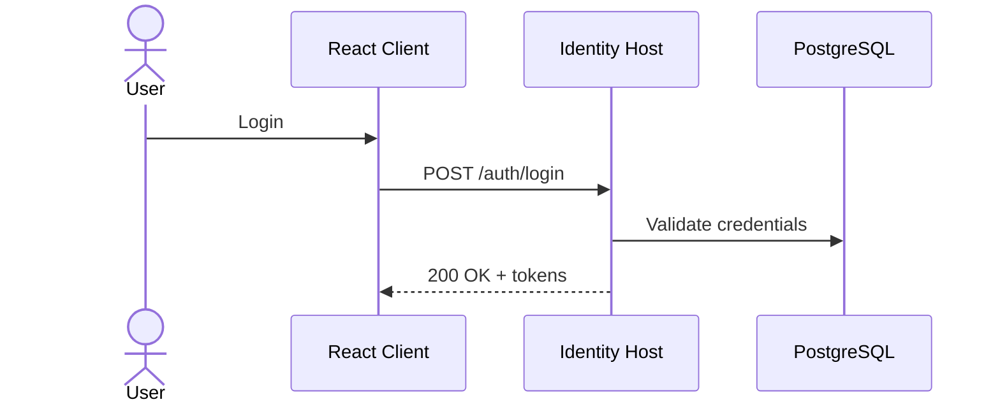

# Goal
Describe the objective in one sentence (machine-readable intent).

# Preconditions
- Repo location: cloned and working directory at repo root.
- .NET SDK: 9.x installed and on PATH.
- Database: PostgreSQL 16 available (Docker or local).
- Secrets: listed in front matter are available (dotenv or environment).

# Resources
- Link to relevant package docs, guides, and external references.

# Command Steps
Command: dotnet --info
```bash
dotnet --info
```

Command: dotnet restore Identity.sln
```bash
dotnet restore Identity.sln
```

Optional Step 3: Start local dependencies via Docker Compose
Command: docker compose -f docker-compose.local.yml up -d postgres mailhog
```bash
docker compose -f docker-compose.local.yml up -d postgres mailhog
```

# File Edits
- path: some/project/file.cs
  - Insert after anchor `// [Anchor: RegistrationOptions]`:
    ```csharp
    // minimal, targeted snippet
    ```

# Configuration Snippets
Config: appsettings.Development.json (excerpt)
```json
{
  "ConnectionStrings": { "Primary": "Host=localhost;Database=identity;Username=identity;Password=identity" },
  "MailJet": { "ApiKey": "...", "ApiSecret": "...", "FromEmail": "noreply@example.com", "FromName": "Identity" }
}
```

# Verification
Command: dotnet build -c Debug Identity.sln
```bash
dotnet build -c Debug Identity.sln
```
Expect: build Succeeded, 0 Errors.

Command: dotnet test -c Debug Identity.sln --nologo
```bash
dotnet test -c Debug Identity.sln --nologo
```
Expect: all tests passed (report shows N passed, 0 failed).

# Diagram


# Outputs
- Note any created assets: connection strings used, seeded users, client ids.

# Completion Checklist
- [ ] Commands completed without errors.
- [ ] Verification criteria met (build/tests/HTTP checks).
- [ ] Configuration applied and committed where appropriate.
