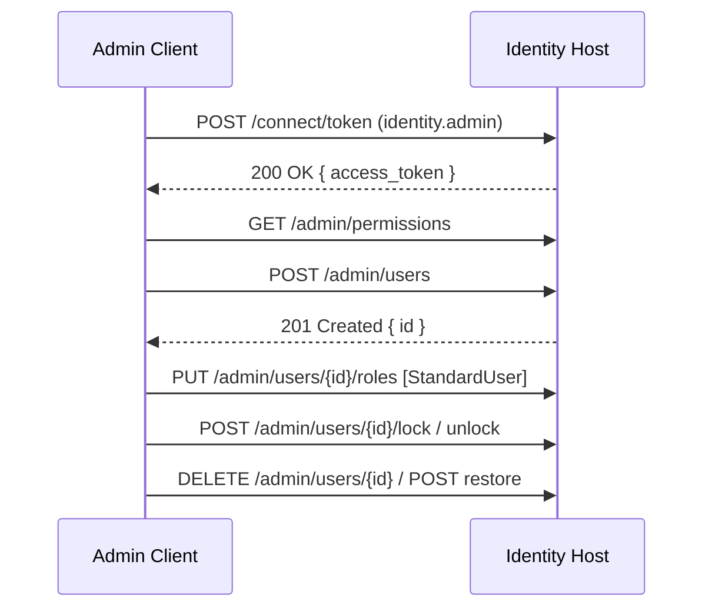

# Goal
Exercise key Admin endpoints end-to-end: list permissions, create a user, assign roles, lock/unlock, and soft delete/restore. Verify success criteria and expected responses.

# Preconditions
- Identity Host running and exposing `/admin/*` endpoints.
- Admin scope enabled (`IdentityAdmin:RequiredScope=identity.admin`) and granted to the SPA/client you use for tokens.
- Seeded admin user exists with the required permissions (`users.read`, `users.create`, `users.update`, `users.lock`, `users.manage-roles`, `users.delete`, `roles.read`, `roles.manage`).

# Resources
- Admin package: docs/packages/identity-base-admin/index.md
- Roles package: docs/packages/identity-base-roles/index.md

# Command Steps
Command: Obtain admin token (password grant)
```bash
ADMIN_TOKEN=$(curl -s -X POST http://localhost:8080/connect/token \
  -H "Content-Type: application/x-www-form-urlencoded" \
  -d 'grant_type=password&username=admin@example.com&password=P@ssword12345!&client_id=spa-client&scope=openid profile email offline_access identity.api identity.admin' | jq -r .access_token); test -n "$ADMIN_TOKEN" && echo OK || echo FAIL
```

Command: List canonical permissions
```bash
curl -s "http://localhost:8080/admin/permissions?page=1&pageSize=50" -H "Authorization: Bearer $ADMIN_TOKEN" | jq '{count: (.items | length)}'
```

Command: Create a user (returns 201 Created)
```bash
NEW_EMAIL="test.user+$(date +%s)@example.com"; CREATE_RESP=$(curl -s -X POST http://localhost:8080/admin/users \
  -H "Authorization: Bearer $ADMIN_TOKEN" \
  -H "Content-Type: application/json" \
  -d "{ \"email\": \"$NEW_EMAIL\", \"password\": \"P@ssword12345!\", \"emailConfirmed\": true }" ); echo "$CREATE_RESP" | jq '.'; NEW_USER_ID=$(echo "$CREATE_RESP" | jq -r '.id // empty'); echo $NEW_USER_ID
```

Command: Fetch created user details
```bash
curl -s http://localhost:8080/admin/users/$NEW_USER_ID -H "Authorization: Bearer $ADMIN_TOKEN" | jq '{id, email, emailConfirmed, isLockedOut}'
```

Command: Assign StandardUser role
```bash
curl -s -X PUT http://localhost:8080/admin/users/$NEW_USER_ID/roles \
  -H "Authorization: Bearer $ADMIN_TOKEN" \
  -H "Content-Type: application/json" \
  -d '["StandardUser"]' -i | head -n1
```

Command: Verify roles for the user
```bash
curl -s http://localhost:8080/admin/users/$NEW_USER_ID/roles -H "Authorization: Bearer $ADMIN_TOKEN" | jq '.'
```

Command: Lock the user (30-day default)
```bash
curl -s -X POST http://localhost:8080/admin/users/$NEW_USER_ID/lock \
  -H "Authorization: Bearer $ADMIN_TOKEN" \
  -H "Content-Type: application/json" \
  -d '{"minutes": 5}' -i | head -n1
```

Command: Unlock the user
```bash
curl -s -X POST http://localhost:8080/admin/users/$NEW_USER_ID/unlock -H "Authorization: Bearer $ADMIN_TOKEN" -i | head -n1
```

Optional Step 8: Force password reset (202 Accepted)
Command: curl -s -X POST http://localhost:8080/admin/users/$NEW_USER_ID/force-password-reset -H "Authorization: Bearer $ADMIN_TOKEN" -i | head -n1
```bash
curl -s -X POST http://localhost:8080/admin/users/$NEW_USER_ID/force-password-reset -H "Authorization: Bearer $ADMIN_TOKEN" -i | head -n1
```

Command: Soft delete the user
```bash
curl -s -X DELETE http://localhost:8080/admin/users/$NEW_USER_ID -H "Authorization: Bearer $ADMIN_TOKEN" -i | head -n1
```

Command: Restore the user
```bash
curl -s -X POST http://localhost:8080/admin/users/$NEW_USER_ID/restore -H "Authorization: Bearer $ADMIN_TOKEN" -i | head -n1
```

# Verification
- Permissions endpoint returns a non-zero item count.
- User creation returns 201 and a valid `id`.
- Roles endpoint reflects `StandardUser` after assignment.
- Lock/unlock endpoints return 204 No Content.
- Optional password reset returns 202 Accepted.
- Delete returns 204 No Content, restore returns 204 No Content.

# Diagram


# Outputs
- `NEW_USER_ID` (created user id) and evidence of role assignment/lock state changes.

# Completion Checklist
- [ ] Admin token acquired.
- [ ] Permissions list non-empty.
- [ ] User created and retrievable.
- [ ] Role assignment reflected.
- [ ] Lock/unlock and delete/restore endpoints succeed.
