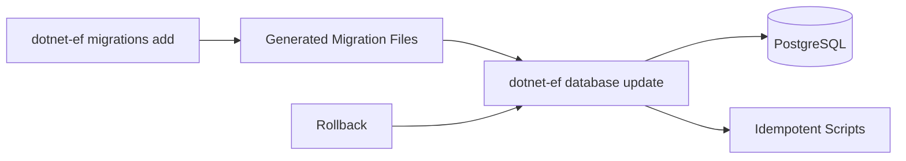

# Goal
Manage EF Core migrations for the Identity Base solution: inspect, add (when extending contexts), apply, script, and roll back migrations for the three DbContexts (AppDbContext, IdentityRolesDbContext, OrganizationDbContext).

# Preconditions
- Hosts own their migrations. The commands below target the sample host (`Identity.Base.Host`). Substitute your own host project when running them.
- Commands target PostgreSQL; adapt as needed if using a different provider.

# Resources
- EF Core CLI: https://learn.microsoft.com/ef/core/cli/dotnet
- Packages: docs/packages/identity-base/index.md, docs/packages/identity-base-roles/index.md, docs/packages/identity-base-organizations/index.md

# Command Steps
Command: Install EF Core CLI (once per machine)
```bash
dotnet tool update -g dotnet-ef
```

Command: List AppDbContext migrations (core identity)
```bash
dotnet ef migrations list \
  --project Identity.Base.Host/Identity.Base.Host.csproj \
  --startup-project Identity.Base.Host/Identity.Base.Host.csproj \
  --context Identity.Base.Data.AppDbContext
```

Command: List IdentityRolesDbContext migrations (RBAC)
```bash
dotnet ef migrations list \
  --project Identity.Base.Host/Identity.Base.Host.csproj \
  --startup-project Identity.Base.Host/Identity.Base.Host.csproj \
  --context Identity.Base.Roles.Data.IdentityRolesDbContext
```

Command: List OrganizationDbContext migrations (organizations)
```bash
dotnet ef migrations list \
  --project Identity.Base.Host/Identity.Base.Host.csproj \
  --startup-project Identity.Base.Host/Identity.Base.Host.csproj \
  --context Identity.Base.Organizations.Data.OrganizationDbContext
```

Optional Step 4: Add a custom migration to AppDbContext (only when extending)
Command: dotnet ef migrations add Custom_AddSampleIndex --project Identity.Base/Identity.Base.csproj --startup-project Identity.Base.Host/Identity.Base.Host.csproj --context Identity.Base.Data.AppDbContext
```bash
dotnet ef migrations add Custom_AddSampleIndex \
  --project Identity.Base.Host/Identity.Base.Host.csproj \
  --startup-project Identity.Base.Host/Identity.Base.Host.csproj \
  --context Identity.Base.Data.AppDbContext
```

Optional Step 5: Add a custom migration to IdentityRolesDbContext
Command: dotnet ef migrations add Rbac_Custom_AddCol --project Identity.Base.Roles/Identity.Base.Roles.csproj --startup-project Identity.Base.Host/Identity.Base.Host.csproj --context Identity.Base.Roles.Data.IdentityRolesDbContext
```bash
dotnet ef migrations add Rbac_Custom_AddCol \
  --project Identity.Base.Host/Identity.Base.Host.csproj \
  --startup-project Identity.Base.Host/Identity.Base.Host.csproj \
  --context Identity.Base.Roles.Data.IdentityRolesDbContext
```

Optional Step 6: Add a custom migration to OrganizationDbContext
Command: dotnet ef migrations add Orgs_Custom_AddIndex --project Identity.Base.Organizations/Identity.Base.Organizations.csproj --startup-project Identity.Base.Host/Identity.Base.Host.csproj --context Identity.Base.Organizations.Data.OrganizationDbContext
```bash
dotnet ef migrations add Orgs_Custom_AddIndex \
  --project Identity.Base.Host/Identity.Base.Host.csproj \
  --startup-project Identity.Base.Host/Identity.Base.Host.csproj \
  --context Identity.Base.Organizations.Data.OrganizationDbContext
```

Command: Apply AppDbContext migrations
```bash
dotnet ef database update \
  --project Identity.Base.Host/Identity.Base.Host.csproj \
  --startup-project Identity.Base.Host/Identity.Base.Host.csproj \
  --context Identity.Base.Data.AppDbContext
```

Command: Apply IdentityRolesDbContext migrations
```bash
dotnet ef database update \
  --project Identity.Base.Host/Identity.Base.Host.csproj \
  --startup-project Identity.Base.Host/Identity.Base.Host.csproj \
  --context Identity.Base.Roles.Data.IdentityRolesDbContext
```

Command: Apply OrganizationDbContext migrations
```bash
dotnet ef database update \
  --project Identity.Base.Host/Identity.Base.Host.csproj \
  --startup-project Identity.Base.Host/Identity.Base.Host.csproj \
  --context Identity.Base.Organizations.Data.OrganizationDbContext
```

Command: Generate idempotent SQL scripts (for CI/CD)
```bash
mkdir -p scripts
dotnet ef migrations script \
  --project Identity.Base.Host/Identity.Base.Host.csproj \
  --startup-project Identity.Base.Host/Identity.Base.Host.csproj \
  --context Identity.Base.Data.AppDbContext \
  --idempotent \
  --output scripts/appdb.sql

dotnet ef migrations script \
  --project Identity.Base.Host/Identity.Base.Host.csproj \
  --startup-project Identity.Base.Host/Identity.Base.Host.csproj \
  --context Identity.Base.Roles.Data.IdentityRolesDbContext \
  --idempotent \
  --output scripts/rbac.sql

dotnet ef migrations script \
  --project Identity.Base.Host/Identity.Base.Host.csproj \
  --startup-project Identity.Base.Host/Identity.Base.Host.csproj \
  --context Identity.Base.Organizations.Data.OrganizationDbContext \
  --idempotent \
  --output scripts/orgs.sql
```

Command: Roll back AppDbContext to previous migration (example)
```bash
dotnet ef database update LastGoodMigration \
  --project Identity.Base.Host/Identity.Base.Host.csproj \
  --startup-project Identity.Base.Host/Identity.Base.Host.csproj \
  --context Identity.Base.Data.AppDbContext
```

Optional Step 12: Verify DB objects (psql)
Command: psql "$CONNECTIONSTRINGS__PRIMARY" -c "\dt+" | head -n 20
```bash
psql "$CONNECTIONSTRINGS__PRIMARY" -c "\\dt+" | head -n 20
```

# Configuration Snippets
Config: .env
```bash
CONNECTIONSTRINGS__PRIMARY=Host=localhost;Database=identity;Username=identity;Password=identity
```

# Verification
Command: List migrations after add/apply
```bash
dotnet ef migrations list \
  --project Identity.Base.Host/Identity.Base.Host.csproj \
  --startup-project Identity.Base.Host/Identity.Base.Host.csproj \
  --context Identity.Base.Data.AppDbContext | tail -n 5
```
Expect: New migration name appears and `database update` completed without errors.

Command: Start host and confirm DB health
```bash
dotnet run --project Identity.Base.Host & sleep 2 && curl -s http://localhost:8080/healthz | jq -r '.checks[] | select(.name=="database") | .status'
```
Expect: Healthy

# Diagram


# Outputs
- Generated migrations (only when extending contexts) and/or SQL scripts under `scripts/`.
- Database updated to the desired migration for each context.

# Completion Checklist
- [ ] EF CLI installed and reachable.
- [ ] Migrations listed for all three contexts.
- [ ] Database update completed successfully.
- [ ] Host health check reports `database` = `Healthy`.
