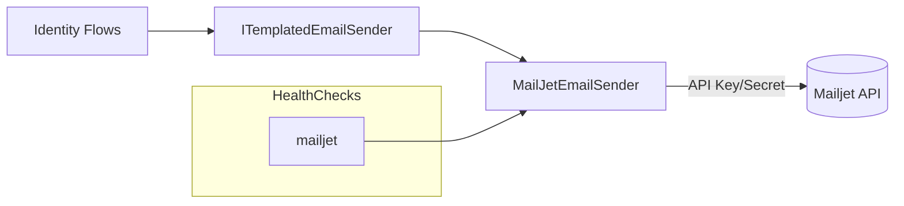

# Goal
Configure and verify the Mailjet-backed email sender, ensuring the `mailjet` health check reports `Healthy` and Identity flows use templated emails.

# Preconditions
- Working directory at repo root.
- `.env` exists (copy from `.env.example` if needed).
- Mailjet account with 3 template IDs: Confirmation, PasswordReset, MfaChallenge.

# Resources
- Package docs: docs/packages/identity-base-email-mailjet/index.md
- Guide: docs/guides/mailjet-email-sender.md
- Docker guide: docs/guides/docker.md

# Command Steps
Optional Step 1: Create `.env` from example
Command: cp .env.example .env
```bash
cp .env.example .env
```

Command: dotnet restore Identity.sln
```bash
dotnet restore Identity.sln
```

Command: dotnet build -c Debug Identity.sln
```bash
dotnet build -c Debug Identity.sln
```

Optional Step 4: Start Postgres and Mailhog
Command: docker compose -f docker-compose.local.yml up -d postgres mailhog
```bash
docker compose -f docker-compose.local.yml up -d postgres mailhog
```

Command: Start API with Docker Compose (reads `.env`)
Command: docker compose -f docker-compose.local.yml up -d identity-api
```bash
docker compose -f docker-compose.local.yml up -d identity-api
```

Optional Step 6: Run API without Docker (supply connection string inline)
Command: ConnectionStrings__Primary="Host=localhost;Database=identity;Username=identity;Password=identity" dotnet run --project Identity.Base.Host
```bash
ConnectionStrings__Primary="Host=localhost;Database=identity;Username=identity;Password=identity" dotnet run --project Identity.Base.Host
```

# File Edits
- No code changes needed; `Identity.Base.Host` already calls `UseMailJetEmailSender()`. Supply configuration via environment or appsettings.

# Configuration Snippets
Config: .env (enable Mailjet; provide credentials and template IDs)
```bash
MAILJET__ENABLED=true
MAILJET__APIKEY=your-mailjet-api-key
MAILJET__APISECRET=your-mailjet-api-secret
MAILJET__FROMEMAIL=noreply@example.com
MAILJET__FROMNAME=Identity Base
MAILJET__TEMPLATES__CONFIRMATION=1000000
MAILJET__TEMPLATES__PASSWORDRESET=1000001
MAILJET__TEMPLATES__MFACHALLENGE=1000002
```

Config: appsettings.Development.json (optional alternative to environment)
```json
{
  "MailJet": {
    "Enabled": true,
    "ApiKey": "your-mailjet-api-key",
    "ApiSecret": "your-mailjet-api-secret",
    "FromEmail": "noreply@example.com",
    "FromName": "Identity Base",
    "Templates": {
      "Confirmation": 1000000,
      "PasswordReset": 1000001,
      "MfaChallenge": 1000002
    },
    "ErrorReporting": { "Enabled": false }
  }
}
```

# Verification
Command: curl -s http://localhost:8080/healthz | jq -r '.status'
```bash
curl -s http://localhost:8080/healthz | jq -r '.status'
```
Expect: Healthy

Command: curl -s http://localhost:8080/healthz | jq -r '.checks[] | select(.name=="mailjet") | .status'
```bash
curl -s http://localhost:8080/healthz | jq -r '.checks[] | select(.name=="mailjet") | .status'
```
Expect: Healthy

Optional Step 3: Simulate missing template (expect degraded)
Command: MAILJET__TEMPLATES__MFACHALLENGE=0 docker compose -f docker-compose.local.yml up -d identity-api && sleep 2 && curl -s http://localhost:8080/healthz | jq -r '.checks[] | select(.name=="mailjet") | .status'
```bash
MAILJET__TEMPLATES__MFACHALLENGE=0 docker compose -f docker-compose.local.yml up -d identity-api && sleep 2 && curl -s http://localhost:8080/healthz | jq -r '.checks[] | select(.name=="mailjet") | .status'
```
Expect: Degraded

# Diagram


# Outputs
- Mailjet Enabled = true; API Key/Secret configured; FromEmail/FromName set.
- Template IDs recorded: Confirmation, PasswordReset, MfaChallenge.

# Completion Checklist
- [ ] `/healthz` returns `Healthy` overall.
- [ ] `mailjet` health check is `Healthy`.
- [ ] Mailjet templates configured and non-zero.
