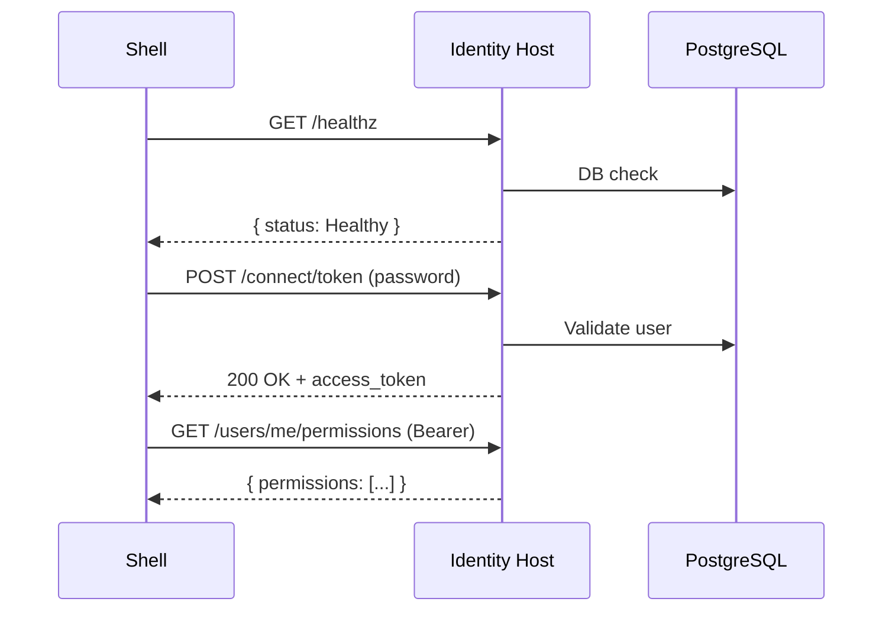

# Goal
Run the Identity Host end-to-end, validate health checks, obtain a token, and exercise protected endpoints. Optionally verify Organizations endpoints if wired.

# Preconditions
- Seed admin user configured (see Roles/Org seed playbook) or `IdentitySeed.Enabled=true` with credentials.
- If testing via Docker Compose, `.env` contains required variables.

# Resources
- Getting Started: docs/guides/getting-started.md
- Full-Stack Integration Guide: docs/guides/full-stack-integration-guide.md
- Health and endpoints: docs/packages/identity-base/index.md

# Command Steps
Optional Step 1: Start Postgres and Mailhog
Command: docker compose -f docker-compose.local.yml up -d postgres mailhog
```bash
docker compose -f docker-compose.local.yml up -d postgres mailhog
```

Command: Build and run tests
```bash
dotnet build -c Debug Identity.sln && dotnet test -c Debug Identity.sln --nologo
```

Command: Start the Identity Host (without Docker)
```bash
ConnectionStrings__Primary="Host=localhost;Database=identity;Username=identity;Password=identity" dotnet run --project Identity.Base.Host
```

# Verification
Command: Health check overall status
```bash
curl -s http://localhost:8080/healthz | jq -r '.status'
```
Expect: Healthy

Command: Health check details (database, externalProviders, mailjet if enabled)
```bash
curl -s http://localhost:8080/healthz | jq '[.checks[] | {name, status}]'
```
Expect: Includes `{ name: "database", status: "Healthy" }`. If Mailjet enabled, `{ name: "mailjet", status: "Healthy" }`.

Command: Obtain access token via password grant (seed admin)
```bash
ACCESS_TOKEN=$(curl -s -X POST http://localhost:8080/connect/token \
  -H "Content-Type: application/x-www-form-urlencoded" \
  -d 'grant_type=password&username=admin@example.com&password=P@ssword12345!&client_id=spa-client&scope=openid profile email offline_access identity.api identity.admin' | jq -r .access_token); test -n "$ACCESS_TOKEN" && echo OK || echo FAIL
```
Expect: OK (non-empty access token captured in ACCESS_TOKEN)

Optional Step 4: Verify roles/permissions endpoint
Command: curl -s http://localhost:8080/users/me/permissions -H "Authorization: Bearer $ACCESS_TOKEN" | jq '.permissions | length'
```bash
curl -s http://localhost:8080/users/me/permissions -H "Authorization: Bearer $ACCESS_TOKEN" | jq '.permissions | length'
```
Expect: A non-zero count when admin roles are seeded.

Optional Step 5: Verify organizations endpoints (if mapped)
Command: curl -s http://localhost:8080/organizations -H "Authorization: Bearer $ACCESS_TOKEN" | jq 'length'
```bash
curl -s http://localhost:8080/organizations -H "Authorization: Bearer $ACCESS_TOKEN" | jq 'length'
```
Expect: Zero or more organizations; non-error response confirms mapping and auth.

# Diagram


# Outputs
- Confirmation that the host is healthy and issuing tokens.
- Optional validation of permissions and organization endpoints.

# Completion Checklist
- [ ] `dotnet build` and `dotnet test` succeeded.
- [ ] `/healthz` status is `Healthy`.
- [ ] Token obtained successfully for the seed admin.
- [ ] Optional: permissions listed; organizations endpoint reachable.
