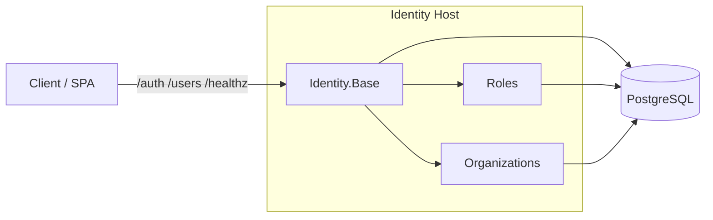

# Goal
Provision and run Identity Base with Roles and Organizations enabled, verify `/healthz`, and run the test suite.

# Preconditions
- Working directory at repo root.
- .NET 9 installed on PATH.
- Docker available (for local Postgres and Mailhog) or a reachable PostgreSQL 16 instance.
- `.env` present (you can copy `.env.example` and adjust as needed).

# Resources
- Core package docs: docs/packages/identity-base/index.md
- Roles: docs/packages/identity-base-roles/index.md
- Organizations: docs/packages/identity-base-organizations/index.md
- Getting Started: docs/guides/getting-started.md
- Docker guide: docs/guides/docker.md

# Command Steps
Command: dotnet restore Identity.sln
```bash
dotnet restore Identity.sln
```

Command: dotnet build -c Debug Identity.sln
```bash
dotnet build -c Debug Identity.sln
```

Optional Step 3: Start Postgres and Mailhog
Command: docker compose -f docker-compose.local.yml up -d postgres mailhog
```bash
docker compose -f docker-compose.local.yml up -d postgres mailhog
```

Optional Step 4: Launch the Identity API via Docker Compose
Command: docker compose -f docker-compose.local.yml up -d identity-api
```bash
docker compose -f docker-compose.local.yml up -d identity-api
```

Optional Step 5: Run the Identity Host directly (alternative to Docker)
Command: ConnectionStrings__Primary="Host=localhost;Database=identity;Username=identity;Password=identity" dotnet run --project Identity.Base.Host
```bash
ConnectionStrings__Primary="Host=localhost;Database=identity;Username=identity;Password=identity" dotnet run --project Identity.Base.Host
```

# File Edits
- No code edits required for a default run. To enable Mailjet locally, set the environment variables in `.env` matching `docker-compose.local.yml` keys (see Configuration Snippets).

# Configuration Snippets
Config: .env (excerpt)
```bash
CONNECTIONSTRINGS__PRIMARY=Host=localhost;Database=identity;Username=identity;Password=identity
MAILJET__APIKEY=
MAILJET__APISECRET=
MAILJET__FROMEMAIL=noreply@example.com
MAILJET__FROMNAME=Identity
MAILJET__TEMPLATES__CONFIRMATION=
MAILJET__TEMPLATES__PASSWORDRESET=
MAILJET__TEMPLATES__MFACHALLENGE=
MFA__ISSUER=Identity Base
EXTERNALPROVIDERS__GOOGLE__ENABLED=false
EXTERNALPROVIDERS__MICROSOFT__ENABLED=false
EXTERNALPROVIDERS__APPLE__ENABLED=false
```

# Verification
Command: dotnet test -c Debug Identity.sln --nologo
```bash
dotnet test -c Debug Identity.sln --nologo
```
Expect: All tests passed (no failures).

Command: curl -s http://localhost:8080/healthz | jq '.status'
```bash
curl -s http://localhost:8080/healthz | jq '.status'
```
Expect: "Healthy".

Command: curl -s http://localhost:8080/healthz | jq '.checks | map({name,status})'
```bash
curl -s http://localhost:8080/healthz | jq '.checks | map({name,status})'
```
Expect: Includes at least `{ name: "database", status: "Healthy" }` and, if Mailjet keys are provided, `{ name: "mailjet", status: "Healthy" }`.

# Diagram


# Outputs
- Running API at `http://localhost:8080` (Docker) or the port shown by `dotnet run`.
- Verified health status and healthy checks.

# Completion Checklist
- [ ] `dotnet build` succeeded with 0 errors.
- [ ] `dotnet test` completed with all tests passing.
- [ ] `/healthz` returned `"Healthy"` and database check is healthy.
