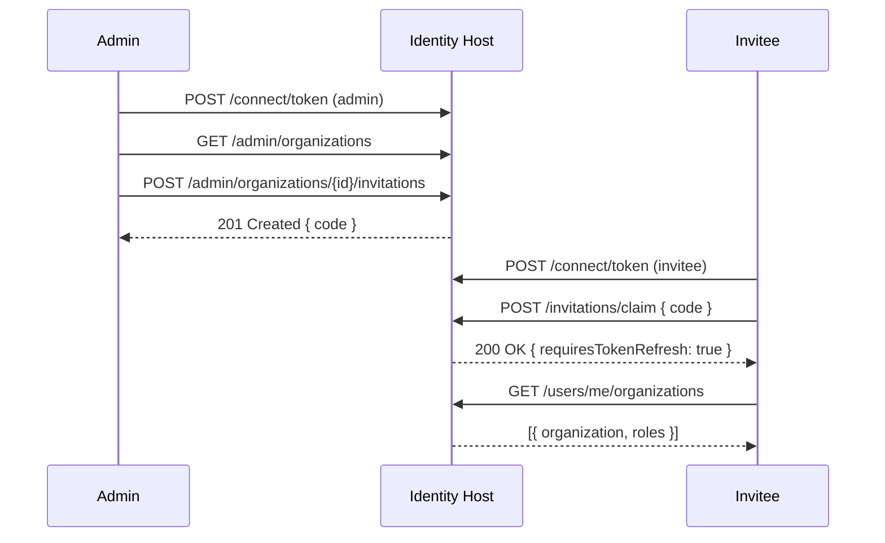

# Goal
Create an organization invitation, retrieve it, claim it as the invited user, and verify membership. Uses admin APIs to provision the invitee account with confirmed email for a frictionless flow.

# Preconditions
- Identity Host running and accessible at `http://localhost:8080`.
- An organization exists; if not, this playbook includes an optional step to create one.
- Seeded admin exists (see seed-roles-and-default-organization playbook) with admin permissions.

# Resources
- Organizations package: docs/packages/identity-base-organizations/index.md
- Admin endpoints: docs/packages/identity-base-roles/index.md and README references

# Command Steps
Command: Obtain admin token (seeded user)
```bash
ADMIN_TOKEN=$(curl -s -X POST http://localhost:8080/connect/token \
  -H "Content-Type: application/x-www-form-urlencoded" \
  -d 'grant_type=password&username=admin@example.com&password=P@ssword12345!&client_id=spa-client&scope=openid profile email offline_access identity.api identity.admin' | jq -r .access_token); test -n "$ADMIN_TOKEN" && echo OK || echo FAIL
```

Command: Capture an existing organization id (first item)
```bash
ORG_ID=$(curl -s http://localhost:8080/admin/organizations -H "Authorization: Bearer $ADMIN_TOKEN" | jq -r '.[0].id // empty'); if [ -z "$ORG_ID" ]; then echo "NO_ORGS"; else echo $ORG_ID; fi
```

Optional Step 3: Create an organization if none exists
Command: if [ -z "$ORG_ID" ] || [ "$ORG_ID" = "NO_ORGS" ]; then ORG_ID=$(curl -s -X POST http://localhost:8080/admin/organizations -H "Authorization: Bearer $ADMIN_TOKEN" -H "Content-Type: application/json" -d '{"slug":"acme","displayName":"Acme Corp"}' | jq -r '.id'); echo $ORG_ID; fi
```bash
if [ -z "$ORG_ID" ] || [ "$ORG_ID" = "NO_ORGS" ]; then ORG_ID=$(curl -s -X POST http://localhost:8080/admin/organizations -H "Authorization: Bearer $ADMIN_TOKEN" -H "Content-Type: application/json" -d '{"slug":"acme","displayName":"Acme Corp"}' | jq -r '.id'); echo $ORG_ID; fi
```

Command: Create invitee user via admin API (email confirmed + password)
```bash
INVITEE_EMAIL="bob@example.com"; curl -s -X POST http://localhost:8080/admin/users \
  -H "Authorization: Bearer $ADMIN_TOKEN" \
  -H "Content-Type: application/json" \
  -d "{ \"email\": \"$INVITEE_EMAIL\", \"password\": \"P@ssword12345!\", \"emailConfirmed\": true }" | jq -r '.id // empty'
```

Command: Create invitation for the organization
```bash
INV_CODE=$(curl -s -X POST http://localhost:8080/admin/organizations/$ORG_ID/invitations \
  -H "Authorization: Bearer $ADMIN_TOKEN" \
  -H "Content-Type: application/json" \
  -d "{ \"email\": \"$INVITEE_EMAIL\" }" | jq -r '.code'); echo $INV_CODE
```

Command: Retrieve public invitation metadata
```bash
curl -s http://localhost:8080/invitations/$INV_CODE | jq '{code, organizationId, organizationSlug, organizationName}'
```

Command: Obtain invitee token
```bash
INV_TOKEN=$(curl -s -X POST http://localhost:8080/connect/token \
  -H "Content-Type: application/x-www-form-urlencoded" \
  -d "grant_type=password&username=$INVITEE_EMAIL&password=P@ssword12345!&client_id=spa-client&scope=openid profile email offline_access identity.api" | jq -r .access_token); test -n "$INV_TOKEN" && echo OK || echo FAIL
```

Command: Claim the invitation as the invitee
```bash
curl -s -X POST http://localhost:8080/invitations/claim \
  -H "Authorization: Bearer $INV_TOKEN" \
  -H "Content-Type: application/json" \
  -d "{ \"code\": \"$INV_CODE\" }" | jq '{organizationId, organizationSlug, organizationName, requiresTokenRefresh}'
```

Command: Verify invitee membership
```bash
curl -s http://localhost:8080/users/me/organizations -H "Authorization: Bearer $INV_TOKEN" | jq 'map({organization: .organization.displayName, roles: .roleIds})[0]'
```

# Verification
- Admin token acquired (echo OK)
- Non-empty `ORG_ID` captured
- Invitation `code` returned and retrievable via `GET /invitations/{code}`
- Invitee token acquired (echo OK)
- Claim response indicates `requiresTokenRefresh: true`
- Membership list includes the target organization

# Diagram


# Outputs
- `INV_CODE` (invitation code) and the resulting membership for the invitee.

# Completion Checklist
- [ ] Organization present (`ORG_ID` set).
- [ ] Invitation created and retrievable.
- [ ] Invitee can claim and is listed under memberships.
