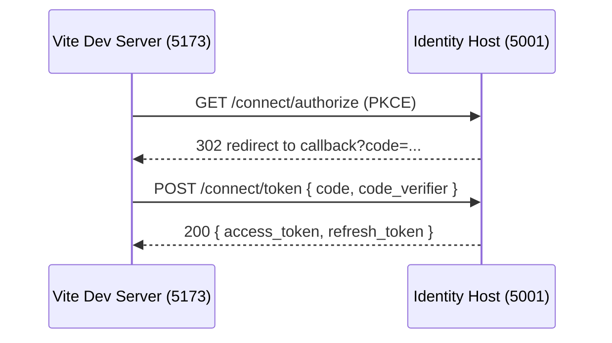

# Goal
Run the sample React SPA at `http://localhost:5173`, complete the Authorization Code PKCE flow against the local Identity Host, and confirm token issuance.

# Preconditions
- Identity Host running locally (HTTPS `https://localhost:5001`) or via Docker Compose (HTTP `http://localhost:8080`).
- SPA redirect URI registered in `OpenIddict:Applications` (e.g., `http://localhost:5173/auth/callback`).

# Resources
- React client package: docs/packages/identity-base-react-client/index.md
- React integration guide: docs/guides/react-integration-guide.md

# Command Steps
Optional Step 1: Install SPA dependencies
Command: cd apps/sample-client && npm ci
```bash
cd apps/sample-client && npm ci
```

Command: Configure SPA `.env` for local host (HTTPS)
```bash
cd apps/sample-client && cp -n .env.example .env || true && sed -i '' 's#^VITE_API_BASE=.*#VITE_API_BASE=https://localhost:5001#' .env && sed -i '' 's#^VITE_AUTHORIZE_REDIRECT=.*#VITE_AUTHORIZE_REDIRECT=http://localhost:5173/auth/callback#' .env
```

Optional Step 3: Configure SPA `.env` for Docker host (HTTP)
Command: cd apps/sample-client && sed -i '' 's#^VITE_API_BASE=.*#VITE_API_BASE=http://localhost:8080#' .env && sed -i '' 's#^VITE_AUTHORIZE_REDIRECT=.*#VITE_AUTHORIZE_REDIRECT=http://localhost:5173/auth/callback#' .env
```bash
cd apps/sample-client && sed -i '' 's#^VITE_API_BASE=.*#VITE_API_BASE=http://localhost:8080#' .env && sed -i '' 's#^VITE_AUTHORIZE_REDIRECT=.*#VITE_AUTHORIZE_REDIRECT=http://localhost:5173/auth/callback#' .env
```

Command: Start the SPA
```bash
cd apps/sample-client && npm run dev -- --port 5173
```

Command: Verify SPA is up
```bash
curl -sI http://localhost:5173 | head -n1
```
Expect: HTTP/1.1 200 (or similar 200 OK line)

Optional Step 6: Start the Identity Host (HTTPS)
Command: ConnectionStrings__Primary="Host=localhost;Database=identity;Username=identity;Password=identity" dotnet run --project Identity.Base.Host
```bash
ConnectionStrings__Primary="Host=localhost;Database=identity;Username=identity;Password=identity" dotnet run --project Identity.Base.Host
```

# Verification (UI path)
- In the browser, open `http://localhost:5173` → Run Authorization Flow.
- Sign in with a valid account (e.g., seeded admin). Expect redirect back to `/auth/callback` and a signed-in state in the SPA header.

# Verification (CLI PKCE path)
Command: Generate PKCE verifier/challenge
```bash
CODE_VERIFIER=$(openssl rand -base64 64 | tr -d '=+/' | cut -c1-128); CODE_CHALLENGE=$(printf %s "$CODE_VERIFIER" | openssl dgst -sha256 -binary | openssl base64 | tr '+/' '-_' | tr -d '='); echo ${CODE_CHALLENGE:0:8}...
```

Command: Build authorize URL (copy into browser)
```bash
echo "$(printf "%s?%s" "https://localhost:5001/connect/authorize" "response_type=code&client_id=spa-client&redirect_uri=http://localhost:5173/auth/callback&scope=openid%20profile%20email%20offline_access%20identity.api&code_challenge=$CODE_CHALLENGE&code_challenge_method=S256&state=playbook")"
```
Expect: Browser prompts for login; after success, URL contains `code=...` at `http://localhost:5173/auth/callback`.

Command: Exchange code for tokens (paste code)
```bash
read -p "Enter authorization code: " AUTH_CODE && curl -s -X POST https://localhost:5001/connect/token \
  -H "Content-Type: application/x-www-form-urlencoded" \
  -d "grant_type=authorization_code&code=$AUTH_CODE&redirect_uri=http://localhost:5173/auth/callback&client_id=spa-client&code_verifier=$CODE_VERIFIER" | jq '{access_token: (.access_token|length>0), expires_in}'
```
Expect: `{ "access_token": true, "expires_in": <seconds> }`

# Diagram


# Outputs
- SPA reachable at `http://localhost:5173`.
- PKCE exchange succeeds with a valid access token.

# Completion Checklist
- [ ] SPA started and serving index page.
- [ ] Authorization flow completed and user signed in.
- [ ] CLI PKCE token exchange returned a non-empty access token.
