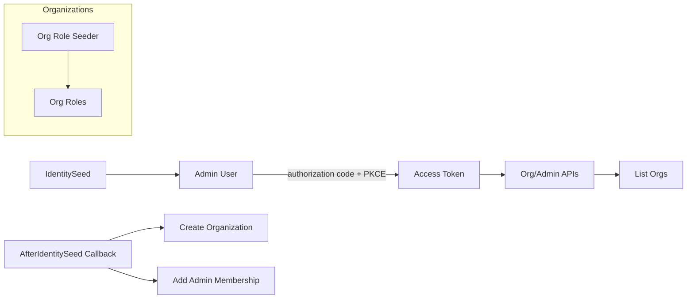

# Goal
Enable RBAC and Organizations in the host, seed an admin user, define admin permissions, create a default organization, and assign the admin as a member. Verify via authenticated API calls.

# Preconditions
- Working directory at repo root.
- `.env` contains `CONNECTIONSTRINGS__PRIMARY` for local Postgres.
- Identity Host is used: `Identity.Base.Host` project.

# Resources
- Roles package: docs/packages/identity-base-roles/index.md
- Organizations package: docs/packages/identity-base-organizations/index.md
- Getting Started: docs/guides/getting-started.md

# Command Steps
Command: dotnet restore Identity.sln
```bash
dotnet restore Identity.sln
```

Command: dotnet build -c Debug Identity.sln
```bash
dotnet build -c Debug Identity.sln
```

Optional Step 3: Start Postgres and Mailhog
Command: docker compose -f docker-compose.local.yml up -d postgres mailhog
```bash
docker compose -f docker-compose.local.yml up -d postgres mailhog
```

Command: Apply migrations for all DbContexts (run from the repo root; adjust host project if needed)
```bash
dotnet ef database update \
  --project Identity.Base.Host/Identity.Base.Host.csproj \
  --startup-project Identity.Base.Host/Identity.Base.Host.csproj \
  --context Identity.Base.Data.AppDbContext

dotnet ef database update \
  --project Identity.Base.Host/Identity.Base.Host.csproj \
  --startup-project Identity.Base.Host/Identity.Base.Host.csproj \
  --context Identity.Base.Roles.Data.IdentityRolesDbContext

dotnet ef database update \
  --project Identity.Base.Host/Identity.Base.Host.csproj \
  --startup-project Identity.Base.Host/Identity.Base.Host.csproj \
  --context Identity.Base.Organizations.Data.OrganizationDbContext
```

# File Edits
- path: Identity.Base.Host/Program.cs
  - Insert after `identityBuilder.UseMailJetEmailSender();`:
    ```csharp
    using Identity.Base.Organizations.Extensions; // at top of file
    using Identity.Base.Organizations.Data;       // at top of file
    using Microsoft.EntityFrameworkCore;          // at top of file

    var organizationsBuilder = builder.Services.AddIdentityBaseOrganizations(options =>
        options.UseNpgsql(builder.Configuration.GetConnectionString("Primary")));

    identityBuilder.AfterIdentitySeed(async (sp, ct) =>
    {
        // Create default organization and add the seed admin as a member
        var orgService = sp.GetRequiredService<Identity.Base.Organizations.Abstractions.IOrganizationService>();
        var memberService = sp.GetRequiredService<Identity.Base.Organizations.Abstractions.IOrganizationMembershipService>();
        var userManager = sp.GetRequiredService<UserManager<Identity.Base.Identity.ApplicationUser>>();
        var seed = sp.GetRequiredService<IOptions<Identity.Base.Options.IdentitySeedOptions>>().Value;
        if (!string.IsNullOrWhiteSpace(seed.Email))
        {
            var user = await userManager.FindByEmailAsync(seed.Email);
            if (user is not null)
            {
                var org = await orgService.CreateAsync(new Identity.Base.Organizations.Abstractions.OrganizationCreateRequest
                {
                    Slug = "acme",
                    DisplayName = "Acme Corp"
                }, ct);

                await memberService.AddMemberAsync(new Identity.Base.Organizations.Abstractions.OrganizationMembershipRequest
                {
                    OrganizationId = org.Id,
                    UserId = user.Id
                }, ct);
            }
        }
    });
    ```
  - Insert before `await app.RunAsync();`:
    ```csharp
    app.MapIdentityBaseOrganizationEndpoints();
    ```

- path: Identity.Base.Host/appsettings.Development.json
  - Ensure sections exist/updated:
    ```json
    {
      "IdentitySeed": {
        "Enabled": true,
        "Email": "admin@example.com",
        "Password": "P@ssword12345!",
        "Roles": ["IdentityAdmin"]
      },
      "Permissions": {
        "Definitions": [
          { "Name": "admin.organizations.read", "Description": "List and view organizations" },
          { "Name": "admin.organizations.manage", "Description": "Create, update, archive organizations" },
          { "Name": "admin.organizations.members.read", "Description": "List members" },
          { "Name": "admin.organizations.members.manage", "Description": "Manage memberships" },
          { "Name": "admin.organizations.roles.read", "Description": "View organization roles" },
          { "Name": "admin.organizations.roles.manage", "Description": "Manage organization roles and permissions" }
        ]
      },
      "Roles": {
        "Definitions": [
          {
            "Name": "IdentityAdmin",
            "Description": "Full administrative access",
            "Permissions": [
              "users.read", "users.create", "users.update", "users.lock",
              "users.reset-password", "users.reset-mfa", "users.manage-roles",
              "users.delete", "roles.read", "roles.manage",
              "admin.organizations.read", "admin.organizations.manage",
              "admin.organizations.members.read", "admin.organizations.members.manage",
              "admin.organizations.roles.read", "admin.organizations.roles.manage"
            ],
            "IsSystemRole": true
          }
        ]
      }
    }
    ```

# Configuration Snippets
Config: .env (Postgres)
```bash
CONNECTIONSTRINGS__PRIMARY=Host=localhost;Database=identity;Username=identity;Password=identity
```

# Verification
Command: dotnet run --project Identity.Base.Host
```bash
dotnet run --project Identity.Base.Host
```
Expect: Host starts, the migration helper confirms the schema is current, and seeds run. Log contains "Seed user admin@example.com created successfully" and organization creation messages.

Command: Acquire access token via authorization code + PKCE
```bash
get_access_token() {
  local email="$1"
  local password="$2"
  local scope="$3"
  local base_url="${BASE_URL:-http://localhost:8080}"
  local redirect_uri="${REDIRECT_URI:-http://localhost:5173/auth/callback}"

  local cookie_jar verifier challenge state location code token
  cookie_jar=$(mktemp)

  verifier=$(openssl rand -base64 32 | tr '+/' '-_' | tr -d '=' | tr -d '\n')
  challenge=$(printf '%s' "$verifier" | openssl dgst -binary -sha256 | openssl base64 -A | tr '+/' '-_' | tr -d '=')
  state=$(openssl rand -hex 16)

  jq -n --arg email "$email" --arg password "$password" --arg clientId "spa-client" \
    '{email:$email,password:$password,clientId:$clientId}' \
    | curl -fsS -c "$cookie_jar" -X POST "$base_url/auth/login" -H "Content-Type: application/json" -d @- >/dev/null

  location=$(curl -fsS -i -o /dev/null -b "$cookie_jar" -G "$base_url/connect/authorize" \
    --data-urlencode "response_type=code" \
    --data-urlencode "client_id=spa-client" \
    --data-urlencode "redirect_uri=$redirect_uri" \
    --data-urlencode "scope=$scope" \
    --data-urlencode "code_challenge=$challenge" \
    --data-urlencode "code_challenge_method=S256" \
    --data-urlencode "state=$state" \
    | awk 'BEGIN{IGNORECASE=1} /^location:/{print $2}' | tr -d '\r')

  code=$(printf '%s' "$location" | sed -n 's/.*[?&]code=\\([^&]*\\).*/\\1/p')

  token=$(curl -fsS -X POST "$base_url/connect/token" -H "Content-Type: application/x-www-form-urlencoded" \
    --data-urlencode "grant_type=authorization_code" \
    --data-urlencode "code=$code" \
    --data-urlencode "redirect_uri=$redirect_uri" \
    --data-urlencode "client_id=spa-client" \
    --data-urlencode "code_verifier=$verifier" \
    | jq -r .access_token)

  rm -f "$cookie_jar"
  printf '%s' "$token"
}

ACCESS_TOKEN=$(get_access_token "admin@example.com" "P@ssword12345!" "openid profile email offline_access identity.api identity.admin")
echo "${ACCESS_TOKEN}" | head -c 20 && echo "..."
```
Expect: Non-empty token printed.

Command: List organizations (should include Acme Corp)
```bash
curl -s http://localhost:8080/admin/organizations -H "Authorization: Bearer $ACCESS_TOKEN" | jq '.[0] | {id, slug, displayName}'
```
Expect: `{ "slug": "acme", "displayName": "Acme Corp" }` with a valid `id`.

Command: Verify membership using member-facing endpoint
```bash
curl -s http://localhost:8080/users/me/organizations -H "Authorization: Bearer $ACCESS_TOKEN" | jq '.[0] | {organization: .organization.displayName, roles: .roleIds}'
```
Expect: Shows membership for "Acme Corp" with the owner role assigned.

# Diagram


# Outputs
- Admin user email/password configured and created.
- Organization "Acme Corp" created; admin membership set as primary.

# Completion Checklist
- [ ] Host compiles and starts without errors.
- [ ] Admin user created and able to obtain access token.
- [ ] `/admin/organizations` returns the seeded organization.
- [ ] `/users/me/organizations` reflects primary membership.
